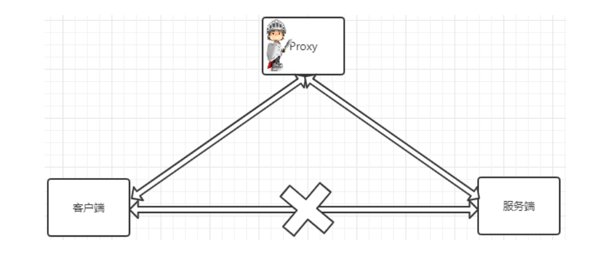
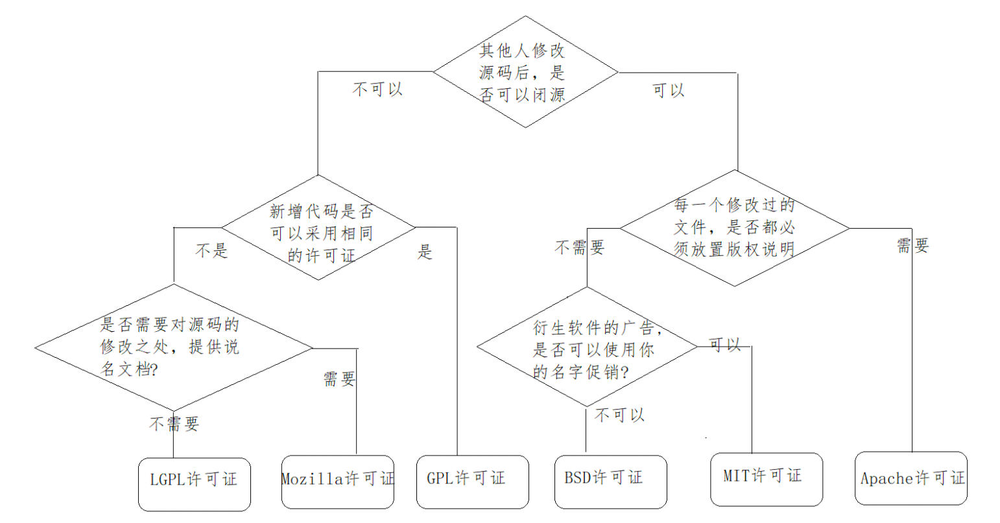
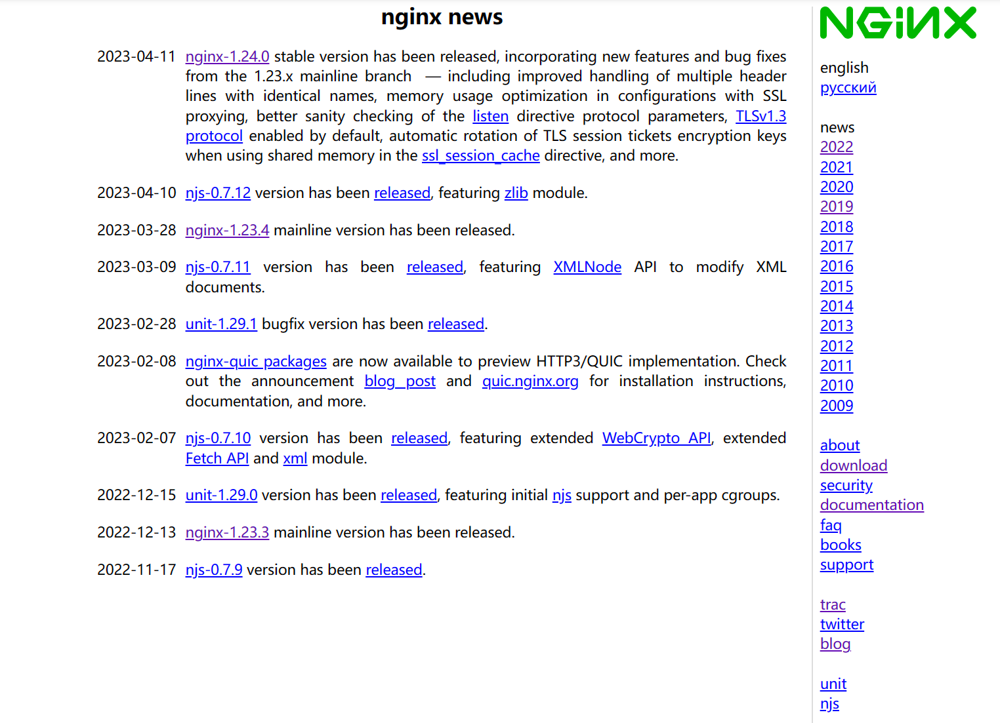
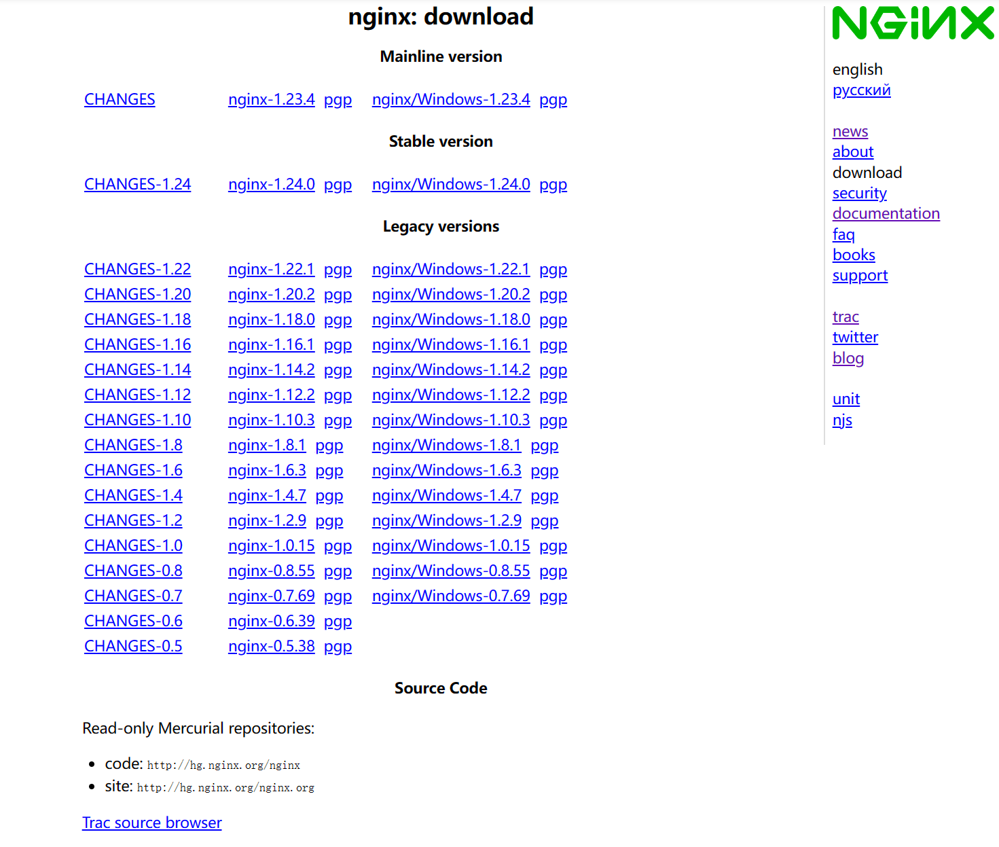
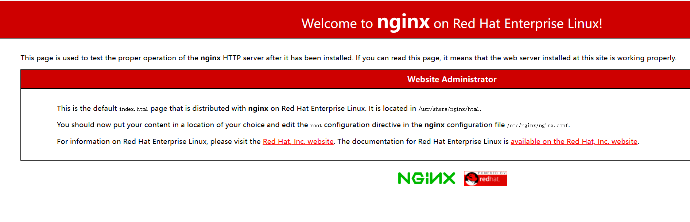
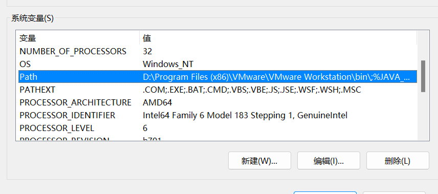
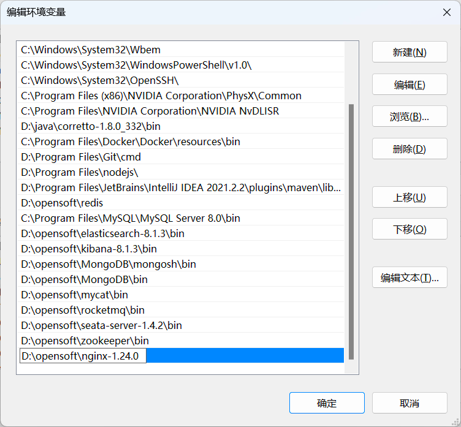

<h1 style="color:skyblue;text-align:center">Nginx学习笔记</h1>


# 概述

Nginx（“engine x”）一个具有高性能的**HTTP**和**反向代理**的**WEB服务器**，同时也是一个**POP3/SMTP/IMAP代理服务器**，是由伊戈尔·赛索耶夫(俄罗斯人)使用C语言编写的，Nginx的第一个版本是2004年10月4号发布的0.1.0版本。另外值得一提的是伊戈尔·赛索耶夫将Nginx的源码进行了开源，这也为Nginx的发展提供了良好的保障。


## 名词解释

### POP3

POP3(Post Offic Protocol 3)邮局协议的第三个版本


### SMTP

SMTP(Simple Mail Transfer Protocol)简单邮件传输协议


### IMAP

IMAP(Internet Mail Access Protocol)交互式邮件存取协议


### 正向代理



正向代理是一个位于客户端和原始服务器(origin server)之间的服务器，为了从原始服务器取得内容，客户端向代理发送一个请求并指定目标(原始服务器)，然后代理向原始服务器转交请求并将获得的内容返回给客户端。客户端才能使用正向代理


### 反向代理


反向代理服务器位于用户与目标服务器之间，但是对于用户而言，反向代理服务器就相当于目标服务器，即用户直接访问反向代理服务器就可以获得目标服务器的资源。同时，用户不需要知道目标服务器的地址，也无须在用户端作任何设定。反向代理服务器通常可用来作为Web加速，即使用反向代理作为Web服务器的前置机来降低网络和服务器的负载，提高访问效率


## Nginx的优点

### 速度更快、并发更高

单次请求或者高并发请求的环境下，Nginx都会比其他Web服务器响应的速度更快。一方面在正常情况下，**单次请求会得到更快的响应**，另一方面，**在高峰期(如有数以万计的并发请求)，Nginx比其他Web服务器更快的响应请求**。Nginx之所以有这么高的并发处理能力和这么好的性能原因在于**Nginx采用了多进程和I/O多路复用(epoll)的底层实现**


### 配置简单，扩展性强

Nginx的设计**极具扩展性**，它本身就是由很多模块组成，这些模块的使用可以通过配置文件的配置来添加。这些模块有官方提供的也有第三方提供的模块，如果需要完全可以开发服务自己业务特性的定制模块


### 高可靠性

Nginx采用的是**多进程模式运行**，其中有**一个master主进程和N多个worker进程**，worker进程的数量我们可以手动设置，每个worker进程之间都是相互独立提供服务，并且master主进程可以在某一个worker进程出错时，快速去"拉起"新的worker进程提供服务


### 热部署

现在互联网项目都要求以7*24小时进行服务的提供，针对于这一要求，Nginx也提供了热部署功能，即**可以在Nginx不停止的情况下，对Nginx进行文件升级、更新配置和更换日志文件**等功能


### 成本低、BSD许可证

BSD是一个开源的许可证

Nginx本身是开源的，我们不仅可以**免费的将Nginx应用在商业领域**，而且**还可以在项目中直接修改Nginx的源码来定制自己的特殊要求**




## Nginx常用功能

### 基本HTTP服务

Nginx可以提供基本HTTP服务，可以作为HTTP代理服务器和反向代理服务器，支持通过缓存加速访问，可以完成简单的负载均衡和容错，支持包过滤功能，支持SSL等。

- 处理静态文件、处理索引文件以及支持自动索引；
- 提供反向代理服务器，并可以使用缓存加上反向代理，同时完成负载均衡和容错；
- 提供对FastCGI、memcached等服务的缓存机制，，同时完成负载均衡和容错；
- 使用Nginx的模块化特性提供过滤器功能。Nginx基本过滤器包括gzip压缩、ranges支持、chunked响应、XSLT、SSI以及图像缩放等。其中针对包含多个SSI的页面，经由FastCGI或反向代理，SSI过滤器可以并行处理。
- 支持HTTP下的安全套接层安全协议SSL.
- 支持基于加权和依赖的优先权的HTTP/2


### 高级HTTP服务

- 支持基于名字和IP的虚拟主机设置
- 支持HTTP/1.0中的KEEP-Alive模式和管线(PipeLined)模型连接
- 自定义访问日志格式、带缓存的日志写操作以及快速日志轮转。
- 提供3xx~5xx错误代码重定向功能
- 支持重写（Rewrite)模块扩展
- 支持重新加载配置以及在线升级时无需中断正在处理的请求
- 支持网络监控
- 支持FLV和MP4流媒体传输


### 邮件服务

Nginx提供邮件代理服务也是其基本开发需求之一，主要包含以下特性：

- 支持IMPA/POP3代理服务功能
- 支持内部SMTP代理服务功能


## Nginx官网

Nginx的官方网站为: http://nginx.org




Nginx的官方下载网站为http://nginx.org/en/download.html




* **Mainline version**：主线版本，开发Nginx的最新版本
* **Stable version**：稳定版本
* **Legacy versions**：旧版本


# 常见服务器

## IIS

全称(**Internet Information Services**)即互联网信息服务，是由微软公司提供的基于windows系统的互联网基本服务。windows作为服务器在稳定性与其他一些性能上都不如类UNIX操作系统，因此在需要高性能Web服务器的场合下，IIS可能就会被"冷落"


## Tomcat

Tomcat是一个运行Servlet和JSP的Web应用软件，Tomcat技术先进、性能稳定而且开放源代码，因此深受Java爱好者的喜爱并得到了部分软件开发商的认可，成为目前比较流行的Web应用服务器。但是Tomcat天生是一个**重量级**的Web服务器，**对静态文件和高并发的处理比较弱**


## Apache

Apache的发展时期很长，同时也有过一段辉煌的业绩。在2014年以前都是市场份额第一的服务器。Apache有很多优点，如**稳定、开源、跨平台**等。但是它出现的时间太久了，在它兴起的年代，互联网的产业规模远远不如今天，所以它被设计成一个**重量级的、不支持高并发**的Web服务器。在Apache服务器上，**如果有数以万计的并发HTTP请求同时访问，就会导致服务器上消耗大量能存，操作系统内核对成百上千的Apache进程做进程间切换也会消耗大量的CUP资源，并导致HTTP请求的平均响应速度降低**，这些都决定了Apache不可能成为高性能的Web服务器。这也促使了Lighttpd和Nginx的出现


## Lighttpd

Lighttpd是德国的一个开源的Web服务器软件，它和Nginx一样，都是**轻量级、高性能**的Web服务器，欧美的业界开发者比较钟爱Lighttpd，而国内的公司更多的青睐Nginx，同时**网上Nginx的资源要更丰富些**


## 其他的服务器

Google Servers，Weblogic, Webshpere(IBM)...


# Nginx安装与运行

## Docker安装

### 第一步：搜索镜像

命令：

```sh
docker search nginx
```

```sh
PS C:\Users\mao\Desktop> docker search nginx
NAME                                              DESCRIPTION                                     STARS     OFFICIAL   AUTOMATED
nginx                                             Official build of Nginx.                        18433     [OK]
linuxserver/nginx                                 An Nginx container, brought to you by LinuxS…   193
bitnami/nginx                                     Bitnami nginx Docker Image                      159                  [OK]
ubuntu/nginx                                      Nginx, a high-performance reverse proxy & we…   86
privatebin/nginx-fpm-alpine                       PrivateBin running on an Nginx, php-fpm & Al…   72                   [OK]
bitnami/nginx-ingress-controller                  Bitnami Docker Image for NGINX Ingress Contr…   25                   [OK]
rancher/nginx-ingress-controller                                                                  11
kasmweb/nginx                                     An Nginx image based off nginx:alpine and in…   6
bitnami/nginx-ldap-auth-daemon                                                                    3
bitnami/nginx-exporter                                                                            3
rapidfort/nginx                                   RapidFort optimized, hardened image for NGINX   3
circleci/nginx                                    This image is for internal use                  2
redash/nginx                                      Pre-configured nginx to proxy linked contain…   2
rancher/nginx-ingress-controller-defaultbackend                                                   2
vmware/nginx                                                                                      2
rancher/nginx                                                                                     2
rapidfort/nginx-official                          RapidFort optimized, hardened image for NGIN…   1
bitnami/nginx-intel                                                                               1
vmware/nginx-photon                                                                               1
rancher/nginx-conf                                                                                0
rancher/nginx-ssl                                                                                 0
rapidfort/nginx-ib                                RapidFort optimized, hardened image for NGIN…   0
unit                                              Official build of NGINX Unit: a polyglot app…   0         [OK]
continuumio/nginx-ingress-ws                                                                      0
rancher/nginx-ingress-controller-amd64                                                            0
PS C:\Users\mao\Desktop>
```


### 第二步：拉取镜像

命令：

```sh
docker pull nginx
```

如果不指定版本，默认使用最新版本

```sh
PS C:\Users\mao\Desktop> docker pull nginx
Using default tag: latest
latest: Pulling from library/nginx
26c5c85e47da: Downloading
4f3256bdf66b: Downloading
2019c71d5655: Downloading
8c767bdbc9ae: Downloading
78e14bb05fd3: Downloading
75576236abf5: Downloading
latest: Pulling from library/nginx
26c5c85e47da: Pull complete
4f3256bdf66b: Pull complete
2019c71d5655: Pull complete
8c767bdbc9ae: Pull complete
78e14bb05fd3: Pull complete
75576236abf5: Pull complete
Digest: sha256:63b44e8ddb83d5dd8020327c1f40436e37a6fffd3ef2498a6204df23be6e7e94
Status: Downloaded newer image for nginx:latest
docker.io/library/nginx:latest
PS C:\Users\mao\Desktop>
```


### 第三步：查看镜像是否拉取成功

命令：

```sh
docker images
```

```sh
PS C:\Users\mao\Desktop> docker images
REPOSITORY          TAG       IMAGE ID       CREATED         SIZE
nginx               latest    6efc10a0510f   2 weeks ago     142MB
redislabs/rebloom   latest    66d626dc1387   17 months ago   147MB
PS C:\Users\mao\Desktop>
```


### 第四步：运行

```sh
docker run  -v D:/Docker/nginx/logs:/var/log/nginx -p 80:80 -d --name nginx nginx
```

```sh
PS C:\Users\mao\Desktop> docker run  -v D:/Docker/nginx/logs:/var/log/nginx -v D:/Docker/nginx/html:/usr/share/nginx/html -v D:/Docker/nginx/conf:/etc/nginx/conf.d -p 80:80 -d --name nginx nginx
8354588d9e6fdc57932f913236e556c8971523f62b65c998ec26bb259f98f146
PS C:\Users\mao\Desktop>
```

```sh
PS C:\Users\mao\Desktop> docker run  -v D:/Docker/nginx/logs:/var/log/nginx -p 80:80 -d --name nginx nginx
4f3ddbf99a0e392fffaf99af51bf055e04d3a300b28bc44d6c551d5487e47d47
PS C:\Users\mao\Desktop>
```


### 第五步：检查运行状态

命令：

```sh
docker ps
```

或者：

```sh
docker ps -a
```


```sh
PS C:\Users\mao\Desktop> docker ps
CONTAINER ID   IMAGE     COMMAND                  CREATED          STATUS          PORTS                NAMES
8354588d9e6f   nginx     "/docker-entrypoint.…"   13 seconds ago   Up 11 seconds   0.0.0.0:80->80/tcp   nginx
PS C:\Users\mao\Desktop>
```

```sh
PS C:\Users\mao\Desktop> docker ps -a
CONTAINER ID   IMAGE               COMMAND                  CREATED          STATUS                     PORTS                     NAMES
4f3ddbf99a0e   nginx               "/docker-entrypoint.…"   20 seconds ago   Up 19 seconds              0.0.0.0:80->80/tcp        nginx
0a3197e86f21   redislabs/rebloom   "docker-entrypoint.s…"   8 weeks ago      Exited (255) 2 weeks ago   0.0.0.0:16379->6379/tcp   redis-redisbloom
PS C:\Users\mao\Desktop>
```


### 第六步：访问Nginx

http://localhost/


### 第六步：进入容器查看日志

```sh
docker exec -it nginx /bin/bash
```

```sh
PS C:\Users\mao\Desktop> docker exec -it nginx /bin/bash
root@4f3ddbf99a0e:/# pwd
/
root@4f3ddbf99a0e:/# type nginx
nginx is /usr/sbin/nginx
root@4f3ddbf99a0e:/# cd /var/log/nginx
root@4f3ddbf99a0e:/var/log/nginx# ls -l
total 8
-rw-r--r-- 1 root root  859 Apr 28 06:26 access.log
-rw-r--r-- 1 root root 2507 Apr 28 06:26 error.log
root@4f3ddbf99a0e:/var/log/nginx# cat access.log
172.17.0.1 - - [28/Apr/2023:06:26:12 +0000] "GET / HTTP/1.1" 200 615 "-" "Mozilla/5.0 (Windows NT 10.0; Win64; x64) AppleWebKit/537.36 (KHTML, like Gecko) Chrome/112.0.0.0 Safari/537.36 Edg/112.0.1722.58" "-"
172.17.0.1 - - [28/Apr/2023:06:26:12 +0000] "GET /favicon.ico HTTP/1.1" 404 555 "http://localhost/" "Mozilla/5.0 (Windows NT 10.0; Win64; x64) AppleWebKit/537.36 (KHTML, like Gecko) Chrome/112.0.0.0 Safari/537.36 Edg/112.0.1722.58" "-"
172.17.0.1 - - [28/Apr/2023:06:26:19 +0000] "GET / HTTP/1.1" 304 0 "-" "Mozilla/5.0 (Windows NT 10.0; Win64; x64) AppleWebKit/537.36 (KHTML, like Gecko) Chrome/112.0.0.0 Safari/537.36 Edg/112.0.1722.58" "-"
172.17.0.1 - - [28/Apr/2023:06:26:19 +0000] "GET / HTTP/1.1" 304 0 "-" "Mozilla/5.0 (Windows NT 10.0; Win64; x64) AppleWebKit/537.36 (KHTML, like Gecko) Chrome/112.0.0.0 Safari/537.36 Edg/112.0.1722.58" "-"
root@4f3ddbf99a0e:/var/log/nginx# cat error.log
2023/04/28 06:25:46 [notice] 1#1: using the "epoll" event method
2023/04/28 06:25:46 [notice] 1#1: nginx/1.23.4
2023/04/28 06:25:46 [notice] 1#1: built by gcc 10.2.1 20210110 (Debian 10.2.1-6)
2023/04/28 06:25:46 [notice] 1#1: OS: Linux 5.10.16.3-microsoft-standard-WSL2
2023/04/28 06:25:46 [notice] 1#1: getrlimit(RLIMIT_NOFILE): 1048576:1048576
2023/04/28 06:25:46 [notice] 1#1: start worker processes
2023/04/28 06:25:46 [notice] 1#1: start worker process 29
2023/04/28 06:25:46 [notice] 1#1: start worker process 30
2023/04/28 06:25:46 [notice] 1#1: start worker process 31
2023/04/28 06:25:46 [notice] 1#1: start worker process 32
2023/04/28 06:25:46 [notice] 1#1: start worker process 33
2023/04/28 06:25:46 [notice] 1#1: start worker process 34
2023/04/28 06:25:46 [notice] 1#1: start worker process 35
2023/04/28 06:25:46 [notice] 1#1: start worker process 36
2023/04/28 06:25:46 [notice] 1#1: start worker process 37
2023/04/28 06:25:46 [notice] 1#1: start worker process 38
2023/04/28 06:25:46 [notice] 1#1: start worker process 39
2023/04/28 06:25:46 [notice] 1#1: start worker process 40
2023/04/28 06:25:46 [notice] 1#1: start worker process 41
2023/04/28 06:25:46 [notice] 1#1: start worker process 42
2023/04/28 06:25:46 [notice] 1#1: start worker process 43
2023/04/28 06:25:46 [notice] 1#1: start worker process 44
2023/04/28 06:25:46 [notice] 1#1: start worker process 45
2023/04/28 06:25:46 [notice] 1#1: start worker process 46
2023/04/28 06:25:46 [notice] 1#1: start worker process 47
2023/04/28 06:25:46 [notice] 1#1: start worker process 48
2023/04/28 06:25:46 [notice] 1#1: start worker process 49
2023/04/28 06:25:46 [notice] 1#1: start worker process 50
2023/04/28 06:25:46 [notice] 1#1: start worker process 51
2023/04/28 06:25:46 [notice] 1#1: start worker process 52
2023/04/28 06:25:46 [notice] 1#1: start worker process 53
2023/04/28 06:25:46 [notice] 1#1: start worker process 54
2023/04/28 06:25:46 [notice] 1#1: start worker process 55
2023/04/28 06:25:46 [notice] 1#1: start worker process 56
2023/04/28 06:25:46 [notice] 1#1: start worker process 57
2023/04/28 06:25:46 [notice] 1#1: start worker process 58
2023/04/28 06:25:46 [notice] 1#1: start worker process 59
2023/04/28 06:25:46 [notice] 1#1: start worker process 60
2023/04/28 06:26:12 [error] 30#30: *2 open() "/usr/share/nginx/html/favicon.ico" failed (2: No such file or directory), client: 172.17.0.1, server: localhost, request: "GET /favicon.ico HTTP/1.1", host: "localhost", referrer: "http://localhost/"
root@4f3ddbf99a0e:/var/log/nginx#
```


## Linux安装


Linux：centOS


### 第一步：准备Linux系统

准备一个内核为2.6及以上版本的操作系统，因为linux2.6及以上内核才支持epoll,而Nginx需要解决高并发压力问题是需要用到epoll，所以我们需要有这样的版本要求

确保centos能联网

确认关闭防火墙


这里为了方便，使用docker的centOS来演示

```sh
PS C:\Users\mao\Desktop> docker search centos
NAME                                         DESCRIPTION                                     STARS     OFFICIAL   AUTOMATED
centos                                       DEPRECATED; The official build of CentOS.       7569      [OK]
kasmweb/centos-7-desktop                     CentOS 7 desktop for Kasm Workspaces            36
couchbase/centos7-systemd                    centos7-systemd images with additional debug…   7                    [OK]
dokken/centos-7                              CentOS 7 image for kitchen-dokken               6
dokken/centos-stream-9                                                                       4
dokken/centos-stream-8                                                                       4
continuumio/centos5_gcc5_base                                                                3
eclipse/centos_jdk8                          CentOS, JDK8, Maven 3, git, curl, nmap, mc, …   3                    [OK]
dokken/centos-8                              CentOS 8 image for kitchen-dokken               3
adoptopenjdk/centos7_build_image                                                             1
spack/centos7                                CentOS 7 with Spack preinstalled                1
spack/centos6                                CentOS 6 with Spack preinstalled                1
atlas/centos7-atlasos                        ATLAS CentOS 7 Software Development OS          0
couchbase/centos-72-java-sdk                                                                 0
ustclug/centos                               Official CentOS Image with USTC Mirror          0
couchbase/centos-72-jenkins-core                                                             0
dokken/centos-6                              CentOS 6 image for kitchen-dokken               0
datadog/centos-i386                                                                          0
couchbase/centos-70-sdk-build                                                                0
couchbase/centos-69-sdk-build                                                                0
couchbase/centos-69-sdk-nodevtoolset-build                                                   0
bitnami/centos-extras-base                                                                   0
corpusops/centos-bare                        https://github.com/corpusops/docker-images/     0
bitnami/centos-base-buildpack                Centos base compilation image                   0                    [OK]
corpusops/centos                             centos corpusops baseimage                      0
PS C:\Users\mao\Desktop> docker pull centos
Using default tag: latest
latest: Pulling from library/centos
a1d0c7532777: Pull complete
Digest: sha256:a27fd8080b517143cbbbab9dfb7c8571c40d67d534bbdee55bd6c473f432b177
Status: Downloaded newer image for centos:latest
docker.io/library/centos:latest
PS C:\Users\mao\Desktop> docker images
REPOSITORY          TAG       IMAGE ID       CREATED         SIZE
nginx               latest    6efc10a0510f   2 weeks ago     142MB
redislabs/rebloom   latest    66d626dc1387   17 months ago   147MB
centos              latest    5d0da3dc9764   19 months ago   231MB
PS C:\Users\mao\Desktop>
```


```sh
docker run -it --name centos -p 8090:80 centos
```


### 第二步：更换yum源

```sh
cd /etc/yum.repos.d/
```

```sh
sed -i 's/mirrorlist/#mirrorlist/g' /etc/yum.repos.d/CentOS-*
sed -i 's|#baseurl=http://mirror.centos.org|baseurl=http://vault.centos.org|g' /etc/yum.repos.d/CentOS-*
```

```sh
yum makecache
```

```sh
yum update -y
```


### 第三步：安装yum-utils

```sh
yum install -y yum-utils
```

```sh
[root@b402c92dee3f /]# yum install -y yum-utils
Failed to set locale, defaulting to C.UTF-8
Last metadata expiration check: 0:06:27 ago on Fri Apr 28 06:56:11 2023.
Dependencies resolved.
================================================================================================================================================
 Package                                       Architecture                Version                            Repository                   Size
================================================================================================================================================
Installing:
 yum-utils                                     noarch                      4.0.21-3.el8                       baseos                       73 k
Installing dependencies:
 dbus-glib                                     x86_64                      0.110-2.el8                        baseos                      127 k
 dnf-plugins-core                              noarch                      4.0.21-3.el8                       baseos                       70 k
 python3-dateutil                              noarch                      1:2.6.1-6.el8                      baseos                      251 k
 python3-dbus                                  x86_64                      1.2.4-15.el8                       baseos                      134 k
 python3-dnf-plugins-core                      noarch                      4.0.21-3.el8                       baseos                      234 k
 python3-six                                   noarch                      1.11.0-8.el8                       baseos                       38 k

Transaction Summary
================================================================================================================================================
Install  7 Packages

Total download size: 927 k
Installed size: 2.3 M
Downloading Packages:
(1/7): dnf-plugins-core-4.0.21-3.el8.noarch.rpm                                                                  51 kB/s |  70 kB     00:01
(2/7): dbus-glib-0.110-2.el8.x86_64.rpm                                                                          78 kB/s | 127 kB     00:01
(3/7): python3-dateutil-2.6.1-6.el8.noarch.rpm                                                                  135 kB/s | 251 kB     00:01
(4/7): python3-dbus-1.2.4-15.el8.x86_64.rpm                                                                     218 kB/s | 134 kB     00:00
(5/7): python3-six-1.11.0-8.el8.noarch.rpm                                                                       87 kB/s |  38 kB     00:00
(6/7): python3-dnf-plugins-core-4.0.21-3.el8.noarch.rpm                                                         316 kB/s | 234 kB     00:00
(7/7): yum-utils-4.0.21-3.el8.noarch.rpm                                                                        170 kB/s |  73 kB     00:00
------------------------------------------------------------------------------------------------------------------------------------------------
Total                                                                                                           385 kB/s | 927 kB     00:02
warning: /var/cache/dnf/baseos-398269605bdca3dc/packages/dbus-glib-0.110-2.el8.x86_64.rpm: Header V3 RSA/SHA256 Signature, key ID 8483c65d: NOKEY
CentOS Linux 8 - BaseOS                                                                                         1.6 MB/s | 1.6 kB     00:00
Importing GPG key 0x8483C65D:
 Userid     : "CentOS (CentOS Official Signing Key) <security@centos.org>"
 Fingerprint: 99DB 70FA E1D7 CE22 7FB6 4882 05B5 55B3 8483 C65D
 From       : /etc/pki/rpm-gpg/RPM-GPG-KEY-centosofficial
Key imported successfully
Running transaction check
Transaction check succeeded.
Running transaction test
Transaction test succeeded.
Running transaction
  Preparing        :                                                                                                                        1/1
  Installing       : python3-six-1.11.0-8.el8.noarch                                                                                        1/7
  Installing       : python3-dateutil-1:2.6.1-6.el8.noarch                                                                                  2/7
  Installing       : dbus-glib-0.110-2.el8.x86_64                                                                                           3/7
  Running scriptlet: dbus-glib-0.110-2.el8.x86_64                                                                                           3/7
  Installing       : python3-dbus-1.2.4-15.el8.x86_64                                                                                       4/7
  Installing       : python3-dnf-plugins-core-4.0.21-3.el8.noarch                                                                           5/7
  Installing       : dnf-plugins-core-4.0.21-3.el8.noarch                                                                                   6/7
  Installing       : yum-utils-4.0.21-3.el8.noarch                                                                                          7/7
  Running scriptlet: yum-utils-4.0.21-3.el8.noarch                                                                                          7/7
  Verifying        : dbus-glib-0.110-2.el8.x86_64                                                                                           1/7
  Verifying        : dnf-plugins-core-4.0.21-3.el8.noarch                                                                                   2/7
  Verifying        : python3-dateutil-1:2.6.1-6.el8.noarch                                                                                  3/7
  Verifying        : python3-dbus-1.2.4-15.el8.x86_64                                                                                       4/7
  Verifying        : python3-dnf-plugins-core-4.0.21-3.el8.noarch                                                                           5/7
  Verifying        : python3-six-1.11.0-8.el8.noarch                                                                                        6/7
  Verifying        : yum-utils-4.0.21-3.el8.noarch                                                                                          7/7

Installed:
  dbus-glib-0.110-2.el8.x86_64              dnf-plugins-core-4.0.21-3.el8.noarch                  python3-dateutil-1:2.6.1-6.el8.noarch
  python3-dbus-1.2.4-15.el8.x86_64          python3-dnf-plugins-core-4.0.21-3.el8.noarch          python3-six-1.11.0-8.el8.noarch
  yum-utils-4.0.21-3.el8.noarch

Complete!
[root@b402c92dee3f /]#
```


### 第四步：yum进行安装

```sh
yum install -y nginx
```

```sh
[root@b402c92dee3f /]# yum install -y nginx
Failed to set locale, defaulting to C.UTF-8
Last metadata expiration check: 0:08:16 ago on Fri Apr 28 06:56:11 2023.
Dependencies resolved.
================================================================================================================================================
 Package                                  Architecture        Version                                              Repository              Size
================================================================================================================================================
Installing:
 nginx                                    x86_64              1:1.14.1-9.module_el8.0.0+184+e34fea82               appstream              570 k
Upgrading:
 ncurses-base                             noarch              6.1-9.20180224.el8                                   baseos                  81 k
 ncurses-libs                             x86_64              6.1-9.20180224.el8                                   baseos                 334 k
 openssl-libs                             x86_64              1:1.1.1k-5.el8_5                                     baseos                 1.5 M
Installing dependencies:
 dejavu-fonts-common                      noarch              2.35-7.el8                                           baseos                  74 k
 dejavu-sans-fonts                        noarch              2.35-7.el8                                           baseos                 1.6 M
 fontconfig                               x86_64              2.13.1-4.el8                                         baseos                 274 k
 fontpackages-filesystem                  noarch              1.44-22.el8                                          baseos                  16 k
 freetype                                 x86_64              2.9.1-4.el8_3.1                                      baseos                 394 k
 gd                                       x86_64              2.2.5-7.el8                                          appstream              144 k
 groff-base                               x86_64              1.22.3-18.el8                                        baseos                 1.0 M
 jbigkit-libs                             x86_64              2.1-14.el8                                           appstream               55 k
 libX11                                   x86_64              1.6.8-5.el8                                          appstream              611 k
 libX11-common                            noarch              1.6.8-5.el8                                          appstream              158 k
 libXau                                   x86_64              1.0.9-3.el8                                          appstream               37 k
 libXpm                                   x86_64              3.5.12-8.el8                                         appstream               58 k
 libjpeg-turbo                            x86_64              1.5.3-12.el8                                         appstream              157 k
 libpng                                   x86_64              2:1.6.34-5.el8                                       baseos                 126 k
 libtiff                                  x86_64              4.0.9-20.el8                                         appstream              188 k
 libwebp                                  x86_64              1.0.0-5.el8                                          appstream              272 k
 libxcb                                   x86_64              1.13.1-1.el8                                         appstream              229 k
 libxslt                                  x86_64              1.1.32-6.el8                                         baseos                 250 k
 ncurses                                  x86_64              6.1-9.20180224.el8                                   baseos                 387 k
 nginx-all-modules                        noarch              1:1.14.1-9.module_el8.0.0+184+e34fea82               appstream               23 k
 nginx-filesystem                         noarch              1:1.14.1-9.module_el8.0.0+184+e34fea82               appstream               24 k
 nginx-mod-http-image-filter              x86_64              1:1.14.1-9.module_el8.0.0+184+e34fea82               appstream               35 k
 nginx-mod-http-perl                      x86_64              1:1.14.1-9.module_el8.0.0+184+e34fea82               appstream               45 k
 nginx-mod-http-xslt-filter               x86_64              1:1.14.1-9.module_el8.0.0+184+e34fea82               appstream               33 k
 nginx-mod-mail                           x86_64              1:1.14.1-9.module_el8.0.0+184+e34fea82               appstream               64 k
 nginx-mod-stream                         x86_64              1:1.14.1-9.module_el8.0.0+184+e34fea82               appstream               85 k
 openssl                                  x86_64              1:1.1.1k-5.el8_5                                     baseos                 709 k
 perl-Carp                                noarch              1.42-396.el8                                         baseos                  30 k
 perl-Data-Dumper                         x86_64              2.167-399.el8                                        baseos                  58 k
 perl-Digest                              noarch              1.17-395.el8                                         appstream               27 k
 perl-Digest-MD5                          x86_64              2.55-396.el8                                         appstream               37 k
 perl-Encode                              x86_64              4:2.97-3.el8                                         baseos                 1.5 M
 perl-Errno                               x86_64              1.28-420.el8                                         baseos                  76 k
 perl-Exporter                            noarch              5.72-396.el8                                         baseos                  34 k
 perl-File-Path                           noarch              2.15-2.el8                                           baseos                  38 k
 perl-File-Temp                           noarch              0.230.600-1.el8                                      baseos                  63 k
 perl-Getopt-Long                         noarch              1:2.50-4.el8                                         baseos                  63 k
 perl-HTTP-Tiny                           noarch              0.074-1.el8                                          baseos                  58 k
 perl-IO                                  x86_64              1.38-420.el8                                         baseos                 142 k
 perl-MIME-Base64                         x86_64              3.15-396.el8                                         baseos                  31 k
 perl-Net-SSLeay                          x86_64              1.88-1.module_el8.3.0+410+ff426aa3                   appstream              379 k
 perl-PathTools                           x86_64              3.74-1.el8                                           baseos                  90 k
 perl-Pod-Escapes                         noarch              1:1.07-395.el8                                       baseos                  20 k
 perl-Pod-Perldoc                         noarch              3.28-396.el8                                         baseos                  86 k
 perl-Pod-Simple                          noarch              1:3.35-395.el8                                       baseos                 213 k
 perl-Pod-Usage                           noarch              4:1.69-395.el8                                       baseos                  34 k
 perl-Scalar-List-Utils                   x86_64              3:1.49-2.el8                                         baseos                  68 k
 perl-Socket                              x86_64              4:2.027-3.el8                                        baseos                  59 k
 perl-Storable                            x86_64              1:3.11-3.el8                                         baseos                  98 k
 perl-Term-ANSIColor                      noarch              4.06-396.el8                                         baseos                  46 k
 perl-Term-Cap                            noarch              1.17-395.el8                                         baseos                  23 k
 perl-Text-ParseWords                     noarch              3.30-395.el8                                         baseos                  18 k
 perl-Text-Tabs+Wrap                      noarch              2013.0523-395.el8                                    baseos                  24 k
 perl-Time-Local                          noarch              1:1.280-1.el8                                        baseos                  34 k
 perl-URI                                 noarch              1.73-3.el8                                           appstream              116 k
 perl-Unicode-Normalize                   x86_64              1.25-396.el8                                         baseos                  82 k
 perl-constant                            noarch              1.33-396.el8                                         baseos                  25 k
 perl-interpreter                         x86_64              4:5.26.3-420.el8                                     baseos                 6.3 M
 perl-libnet                              noarch              3.11-3.el8                                           appstream              121 k
 perl-libs                                x86_64              4:5.26.3-420.el8                                     baseos                 1.6 M
 perl-macros                              x86_64              4:5.26.3-420.el8                                     baseos                  72 k
 perl-parent                              noarch              1:0.237-1.el8                                        baseos                  20 k
 perl-podlators                           noarch              4.11-1.el8                                           baseos                 118 k
 perl-threads                             x86_64              1:2.21-2.el8                                         baseos                  61 k
 perl-threads-shared                      x86_64              1.58-2.el8                                           baseos                  48 k
Installing weak dependencies:
 openssl-pkcs11                           x86_64              0.4.10-2.el8                                         baseos                  66 k
 perl-IO-Socket-IP                        noarch              0.39-5.el8                                           appstream               47 k
 perl-IO-Socket-SSL                       noarch              2.066-4.module_el8.3.0+410+ff426aa3                  appstream              298 k
 perl-Mozilla-CA                          noarch              20160104-7.module_el8.3.0+416+dee7bcef               appstream               15 k
Enabling module streams:
 nginx                                                        1.14
 perl                                                         5.26
 perl-IO-Socket-SSL                                           2.066
 perl-libwww-perl                                             6.34

Transaction Summary
================================================================================================================================================
Install  70 Packages
Upgrade   3 Packages

Total download size: 22 M
Downloading Packages:
(1/73): jbigkit-libs-2.1-14.el8.x86_64.rpm                                                                       39 kB/s |  55 kB     00:01
(2/73): gd-2.2.5-7.el8.x86_64.rpm                                                                                86 kB/s | 144 kB     00:01
(3/73): libXau-1.0.9-3.el8.x86_64.rpm                                                                            81 kB/s |  37 kB     00:00
(4/73): libX11-common-1.6.8-5.el8.noarch.rpm                                                                    138 kB/s | 158 kB     00:01
(5/73): libXpm-3.5.12-8.el8.x86_64.rpm                                                                          120 kB/s |  58 kB     00:00
(6/73): libtiff-4.0.9-20.el8.x86_64.rpm                                                                         279 kB/s | 188 kB     00:00
(7/73): libjpeg-turbo-1.5.3-12.el8.x86_64.rpm                                                                   192 kB/s | 157 kB     00:00
(8/73): libxcb-1.13.1-1.el8.x86_64.rpm                                                                          456 kB/s | 229 kB     00:00
......
(70/73): perl-libs-5.26.3-420.el8.x86_64.rpm                                                                    361 kB/s | 1.6 MB     00:04
(71/73): ncurses-libs-6.1-9.20180224.el8.x86_64.rpm                                                             657 kB/s | 334 kB     00:00
(72/73): perl-threads-shared-1.58-2.el8.x86_64.rpm                                                               20 kB/s |  48 kB     00:02
(73/73): openssl-libs-1.1.1k-5.el8_5.x86_64.rpm                                                                 331 kB/s | 1.5 MB     00:04
------------------------------------------------------------------------------------------------------------------------------------------------
Total                                                                                                           713 kB/s |  22 MB     00:30
Running transaction check
Transaction check succeeded.
Running transaction test
Transaction test succeeded.
Running transaction
  Preparing        :                                                                                                                        1/1
  Upgrading        : openssl-libs-1:1.1.1k-5.el8_5.x86_64                                                                                  1/76
  Running scriptlet: openssl-libs-1:1.1.1k-5.el8_5.x86_64                                                                                  1/76
  Installing       : openssl-1:1.1.1k-5.el8_5.x86_64                                                                                       2/76
  Installing       : openssl-pkcs11-0.4.10-2.el8.x86_64                                                                                    3/76
  Installing       : libpng-2:1.6.34-5.el8.x86_64                                                                           ......                                                                           74/76
  Cleanup          : ncurses-base-6.1-7.20180224.el8.noarch                                                                               75/76
  Cleanup          : openssl-libs-1:1.1.1g-15.el8_3.x86_64                                                                                76/76
  Running scriptlet: openssl-libs-1:1.1.1g-15.el8_3.x86_64                                                                                76/76
  Running scriptlet: fontconfig-2.13.1-4.el8.x86_64                                                                                       76/76
  Verifying        : gd-2.2.5-7.el8.x86_64                                                                                                 1/76
  Verifying        : jbigkit-libs-2.1-14.el8.x86_64                                                                                        2/76
  Verifying        : libX11-1.6.8-5.el8.x86_64                                                                                             3/76
  Verifying        : libX11-common-1.6.8-5.el8.noarch                                                                                      4/76
......                                                                            74/76
  Verifying        : openssl-libs-1:1.1.1k-5.el8_5.x86_64                                                                                 75/76
  Verifying        : openssl-libs-1:1.1.1g-15.el8_3.x86_64                                                                                76/76

Upgraded:
  ncurses-base-6.1-9.20180224.el8.noarch          ncurses-libs-6.1-9.20180224.el8.x86_64          openssl-libs-1:1.1.1k-5.el8_5.x86_64
Installed:
  dejavu-fonts-common-2.35-7.el8.noarch                                      dejavu-sans-fonts-2.35-7.el8.noarch
  fontconfig-2.13.1-4.el8.x86_64                                             fontpackages-filesystem-1.44-22.el8.noarch
  freetype-2.9.1-4.el8_3.1.x86_64                                            gd-2.2.5-7.el8.x86_64
  groff-base-1.22.3-18.el8.x86_64                                            jbigkit-libs-2.1-14.el8.x86_64
  libX11-1.6.8-5.el8.x86_64                                                  libX11-common-1.6.8-5.el8.noarch
  libXau-1.0.9-3.el8.x86_64                                                  libXpm-3.5.12-8.el8.x86_64
  libjpeg-turbo-1.5.3-12.el8.x86_64                                          libpng-2:1.6.34-5.el8.x86_64
  libtiff-4.0.9-20.el8.x86_64                                                libwebp-1.0.0-5.el8.x86_64
  libxcb-1.13.1-1.el8.x86_64                                                 libxslt-1.1.32-6.el8.x86_64
  ncurses-6.1-9.20180224.el8.x86_64                                          nginx-1:1.14.1-9.module_el8.0.0+184+e34fea82.x86_64
  nginx-all-modules-1:1.14.1-9.module_el8.0.0+184+e34fea82.noarch            nginx-filesystem-1:1.14.1-9.module_el8.0.0+184+e34fea82.noarch
  nginx-mod-http-image-filter-1:1.14.1-9.module_el8.0.0+184+e34fea82.x86_64  nginx-mod-http-perl-1:1.14.1-9.module_el8.0.0+184+e34fea82.x86_64
  nginx-mod-http-xslt-filter-1:1.14.1-9.module_el8.0.0+184+e34fea82.x86_64   nginx-mod-mail-1:1.14.1-9.module_el8.0.0+184+e34fea82.x86_64
  nginx-mod-stream-1:1.14.1-9.module_el8.0.0+184+e34fea82.x86_64             openssl-1:1.1.1k-5.el8_5.x86_64
  openssl-pkcs11-0.4.10-2.el8.x86_64                                         perl-Carp-1.42-396.el8.noarch
  perl-Data-Dumper-2.167-399.el8.x86_64                                      perl-Digest-1.17-395.el8.noarch
  perl-Digest-MD5-2.55-396.el8.x86_64                                        perl-Encode-4:2.97-3.el8.x86_64
  perl-Errno-1.28-420.el8.x86_64                                             perl-Exporter-5.72-396.el8.noarch
  perl-File-Path-2.15-2.el8.noarch                                           perl-File-Temp-0.230.600-1.el8.noarch
  perl-Getopt-Long-1:2.50-4.el8.noarch                                       perl-HTTP-Tiny-0.074-1.el8.noarch
  perl-IO-1.38-420.el8.x86_64                                                perl-IO-Socket-IP-0.39-5.el8.noarch
  perl-IO-Socket-SSL-2.066-4.module_el8.3.0+410+ff426aa3.noarch              perl-MIME-Base64-3.15-396.el8.x86_64
  perl-Mozilla-CA-20160104-7.module_el8.3.0+416+dee7bcef.noarch              perl-Net-SSLeay-1.88-1.module_el8.3.0+410+ff426aa3.x86_64
  perl-PathTools-3.74-1.el8.x86_64                                           perl-Pod-Escapes-1:1.07-395.el8.noarch
  perl-Pod-Perldoc-3.28-396.el8.noarch                                       perl-Pod-Simple-1:3.35-395.el8.noarch
  perl-Pod-Usage-4:1.69-395.el8.noarch                                       perl-Scalar-List-Utils-3:1.49-2.el8.x86_64
  perl-Socket-4:2.027-3.el8.x86_64                                           perl-Storable-1:3.11-3.el8.x86_64
  perl-Term-ANSIColor-4.06-396.el8.noarch                                    perl-Term-Cap-1.17-395.el8.noarch
  perl-Text-ParseWords-3.30-395.el8.noarch                                   perl-Text-Tabs+Wrap-2013.0523-395.el8.noarch
  perl-Time-Local-1:1.280-1.el8.noarch                                       perl-URI-1.73-3.el8.noarch
  perl-Unicode-Normalize-1.25-396.el8.x86_64                                 perl-constant-1.33-396.el8.noarch
  perl-interpreter-4:5.26.3-420.el8.x86_64                                   perl-libnet-3.11-3.el8.noarch
  perl-libs-4:5.26.3-420.el8.x86_64                                          perl-macros-4:5.26.3-420.el8.x86_64
  perl-parent-1:0.237-1.el8.noarch                                           perl-podlators-4.11-1.el8.noarch
  perl-threads-1:2.21-2.el8.x86_64                                           perl-threads-shared-1.58-2.el8.x86_64

Complete!
[root@b402c92dee3f /]#
```


### 第五步：查看nginx的安装位置

```sh
whereis nginx
```

```sh
[root@b402c92dee3f /]# whereis nginx
nginx: /usr/sbin/nginx /usr/lib64/nginx /etc/nginx /usr/share/nginx /usr/share/man/man3/nginx.3pm.gz /usr/share/man/man8/nginx.8.gz
[root@b402c92dee3f /]# type nginx
nginx is /usr/sbin/nginx
[root@b402c92dee3f /]#
```


### 第六步：进入可执行文件目录

```sh
cd /usr/sbin
```


### 第七步：启动

```sh
./nginx
```


http://localhost:8090/




### 第八步：查看日志

```sh
[root@b402c92dee3f sbin]# cd /var/log/nginx
[root@b402c92dee3f nginx]# ll
bash: ll: command not found
[root@b402c92dee3f nginx]# ls -l
total 8
-rw-r--r-- 1 root root 1147 Apr 28 07:12 access.log
-rw-r--r-- 1 root root  248 Apr 28 07:10 error.log
[root@b402c92dee3f nginx]# cat access.log
172.17.0.1 - - [28/Apr/2023:07:10:52 +0000] "GET / HTTP/1.1" 200 4057 "-" "Mozilla/5.0 (Windows NT 10.0; Win64; x64) AppleWebKit/537.36 (KHTML, like Gecko) Chrome/112.0.0.0 Safari/537.36 Edg/112.0.1722.58" "-"
172.17.0.1 - - [28/Apr/2023:07:10:52 +0000] "GET /nginx-logo.png HTTP/1.1" 200 368 "http://localhost:8090/" "Mozilla/5.0 (Windows NT 10.0; Win64; x64) AppleWebKit/537.36 (KHTML, like Gecko) Chrome/112.0.0.0 Safari/537.36 Edg/112.0.1722.58" "-"
172.17.0.1 - - [28/Apr/2023:07:10:52 +0000] "GET /poweredby.png HTTP/1.1" 200 4148 "http://localhost:8090/" "Mozilla/5.0 (Windows NT 10.0; Win64; x64) AppleWebKit/537.36 (KHTML, like Gecko) Chrome/112.0.0.0 Safari/537.36 Edg/112.0.1722.58" "-"
172.17.0.1 - - [28/Apr/2023:07:10:52 +0000] "GET /favicon.ico HTTP/1.1" 404 3971 "http://localhost:8090/" "Mozilla/5.0 (Windows NT 10.0; Win64; x64) AppleWebKit/537.36 (KHTML, like Gecko) Chrome/112.0.0.0 Safari/537.36 Edg/112.0.1722.58" "-"
172.17.0.1 - - [28/Apr/2023:07:12:34 +0000] "GET / HTTP/1.1" 304 0 "-" "Mozilla/5.0 (Windows NT 10.0; Win64; x64) AppleWebKit/537.36 (KHTML, like Gecko) Chrome/112.0.0.0 Safari/537.36 Edg/112.0.1722.58" "-"
[root@b402c92dee3f nginx]# cat error.log
2023/04/28 07:10:52 [error] 117#0: *2 open() "/usr/share/nginx/html/favicon.ico" failed (2: No such file or directory), client: 172.17.0.1, server: _, request: "GET /favicon.ico HTTP/1.1", host: "localhost:8090", referrer: "http://localhost:8090/"
[root@b402c92dee3f nginx]#
```


## Windows安装

### 第一步：下载压缩包

http://nginx.org/en/download.html


http://nginx.org/download/nginx-1.24.0.zip


### 第二步：解压

解压后的目录：

```sh
PS D:\opensoft\nginx-1.24.0> ls


    目录: D:\opensoft\nginx-1.24.0


Mode                 LastWriteTime         Length Name
----                 -------------         ------ ----
d-----         2023/4/11     23:31                conf
d-----         2023/4/11     23:31                contrib
d-----         2023/4/11     23:31                docs
d-----         2023/4/11     23:31                html
d-----         2023/4/11     23:31                logs
d-----         2023/4/11     23:31                temp
------         2023/4/11     23:29        3811328 nginx.exe


PS D:\opensoft\nginx-1.24.0>
```


### 第三步：运行

```sh
./nginx
```

或者

```sh
start ./nginx
```


### 第四步：访问

http://localhost/


### 第五步：查看访问日志

```sh
PS D:\opensoft\nginx-1.24.0> ls


    目录: D:\opensoft\nginx-1.24.0


Mode                 LastWriteTime         Length Name
----                 -------------         ------ ----
d-----         2023/4/11     23:31                conf
d-----         2023/4/11     23:31                contrib
d-----         2023/4/11     23:31                docs
d-----         2023/4/11     23:31                html
d-----         2023/4/29     13:31                logs
d-----         2023/4/29     13:29                temp
------         2023/4/11     23:29        3811328 nginx.exe


PS D:\opensoft\nginx-1.24.0> cd logs
PS D:\opensoft\nginx-1.24.0\logs> ls


    目录: D:\opensoft\nginx-1.24.0\logs


Mode                 LastWriteTime         Length Name
----                 -------------         ------ ----
-a----         2023/4/29     13:30            843 access.log
-a----         2023/4/29     13:31            348 error.log
-a----         2023/4/29     13:31              7 nginx.pid


PS D:\opensoft\nginx-1.24.0\logs> cat .\access.log
127.0.0.1 - - [29/Apr/2023:13:30:25 +0800] "GET / HTTP/1.1" 200 615 "-" "Mozilla/5.0 (Windows NT 10.0; Win64; x64) AppleWebKit/537.36 (KHTML, like Gecko) Chrome/112.0.0.0 Safari/537.36 Edg/112.0.1722.64"
127.0.0.1 - - [29/Apr/2023:13:30:25 +0800] "GET /favicon.ico HTTP/1.1" 404 555 "http://localhost/" "Mozilla/5.0 (Windows NT 10.0; Win64; x64) AppleWebKit/537.36 (KHTML, like Gecko) Chrome/112.0.0.0 Safari/537.36 Edg/112.0.1722.64"
127.0.0.1 - - [29/Apr/2023:13:30:27 +0800] "GET / HTTP/1.1" 304 0 "-" "Mozilla/5.0 (Windows NT 10.0; Win64; x64) AppleWebKit/537.36 (KHTML, like Gecko) Chrome/112.0.0.0 Safari/537.36 Edg/112.0.1722.64"
127.0.0.1 - - [29/Apr/2023:13:30:27 +0800] "GET / HTTP/1.1" 304 0 "-" "Mozilla/5.0 (Windows NT 10.0; Win64; x64) AppleWebKit/537.36 (KHTML, like Gecko) Chrome/112.0.0.0 Safari/537.36 Edg/112.0.1722.64"
127.0.0.1 - - [29/Apr/2023:13:32:25 +0800] "GET / HTTP/1.1" 304 0 "-" "Mozilla/5.0 (Windows NT 10.0; Win64; x64) AppleWebKit/537.36 (KHTML, like Gecko) Chrome/112.0.0.0 Safari/537.36 Edg/112.0.1722.64"
127.0.0.1 - - [29/Apr/2023:13:32:25 +0800] "GET / HTTP/1.1" 304 0 "-" "Mozilla/5.0 (Windows NT 10.0; Win64; x64) AppleWebKit/537.36 (KHTML, like Gecko) Chrome/112.0.0.0 Safari/537.36 Edg/112.0.1722.64"
127.0.0.1 - - [29/Apr/2023:13:32:26 +0800] "GET / HTTP/1.1" 304 0 "-" "Mozilla/5.0 (Windows NT 10.0; Win64; x64) AppleWebKit/537.36 (KHTML, like Gecko) Chrome/112.0.0.0 Safari/537.36 Edg/112.0.1722.64"
127.0.0.1 - - [29/Apr/2023:13:32:26 +0800] "GET / HTTP/1.1" 304 0 "-" "Mozilla/5.0 (Windows NT 10.0; Win64; x64) AppleWebKit/537.36 (KHTML, like Gecko) Chrome/112.0.0.0 Safari/537.36 Edg/112.0.1722.64"
127.0.0.1 - - [29/Apr/2023:13:32:26 +0800] "GET / HTTP/1.1" 304 0 "-" "Mozilla/5.0 (Windows NT 10.0; Win64; x64) AppleWebKit/537.36 (KHTML, like Gecko) Chrome/112.0.0.0 Safari/537.36 Edg/112.0.1722.64"
127.0.0.1 - - [29/Apr/2023:13:32:26 +0800] "GET / HTTP/1.1" 304 0 "-" "Mozilla/5.0 (Windows NT 10.0; Win64; x64) AppleWebKit/537.36 (KHTML, like Gecko) Chrome/112.0.0.0 Safari/537.36 Edg/112.0.1722.64"
127.0.0.1 - - [29/Apr/2023:13:32:26 +0800] "GET / HTTP/1.1" 304 0 "-" "Mozilla/5.0 (Windows NT 10.0; Win64; x64) AppleWebKit/537.36 (KHTML, like Gecko) Chrome/112.0.0.0 Safari/537.36 Edg/112.0.1722.64"
127.0.0.1 - - [29/Apr/2023:13:32:26 +0800] "GET / HTTP/1.1" 304 0 "-" "Mozilla/5.0 (Windows NT 10.0; Win64; x64) AppleWebKit/537.36 (KHTML, like Gecko) Chrome/112.0.0.0 Safari/537.36 Edg/112.0.1722.64"
127.0.0.1 - - [29/Apr/2023:13:32:27 +0800] "GET / HTTP/1.1" 304 0 "-" "Mozilla/5.0 (Windows NT 10.0; Win64; x64) AppleWebKit/537.36 (KHTML, like Gecko) Chrome/112.0.0.0 Safari/537.36 Edg/112.0.1722.64"
PS D:\opensoft\nginx-1.24.0\logs> cat .\error.log
2023/04/29 13:30:25 [error] 36316#34412: *1 CreateFile() "D:\opensoft\nginx-1.24.0/html/favicon.ico" failed (2: The system cannot find the file specified), client: 127.0.0.1, server: localhost, request: "GET /favicon.ico HTTP/1.1", host: "localhost", referrer: "http://localhost/"
2023/04/29 13:31:32 [notice] 15804#22388: signal process started
PS D:\opensoft\nginx-1.24.0\logs> cat .\nginx.pid
20112
PS D:\opensoft\nginx-1.24.0\logs>
```


### 第六步：添加至环境变量


在设置中打开系统属性窗口，点击高级


找到Path，点击编辑




点击新建





测试环境变量配置是否成功，在桌面打开控制台

```sh
PS C:\Users\mao\Desktop> nginx -v
nginx version: nginx/1.24.0
PS C:\Users\mao\Desktop>
```


# Nginx目录结构

在使用Nginx之前，先对安装好的Nginx目录文件进行一个分析

```sh
PS D:\opensoft\nginx-1.24.0> tree /F
文件夹 PATH 列表
卷序列号为 5E84-66B0
D:.
│  nginx.exe
│
├─conf
│      fastcgi.conf
│      fastcgi_params
│      koi-utf
│      koi-win
│      mime.types
│      nginx.conf
│      scgi_params
│      uwsgi_params
│      win-utf
│
├─contrib
│  │  geo2nginx.pl
│  │  README
│  │
│  ├─unicode2nginx
│  │      koi-utf
│  │      unicode-to-nginx.pl
│  │      win-utf
│  │
│  └─vim
│      ├─ftdetect
│      │      nginx.vim
│      │
│      ├─ftplugin
│      │      nginx.vim
│      │
│      ├─indent
│      │      nginx.vim
│      │
│      └─syntax
│              nginx.vim
│
├─docs
│      CHANGES
│      CHANGES.ru
│      LICENSE
│      OpenSSL.LICENSE
│      PCRE.LICENCE
│      README
│      zlib.LICENSE
│
├─html
│      50x.html
│      index.html
│
├─logs
│      access.log
│      error.log
│
└─temp
    ├─client_body_temp
    ├─fastcgi_temp
    ├─proxy_temp
    ├─scgi_temp
    └─uwsgi_temp
PS D:\opensoft\nginx-1.24.0>
```


## conf

**nginx所有配置文件目录**

 CGI(Common Gateway Interface)通用网关接口，主要解决的问题是从客户端发送一个请求和数据，服务端获取到请求和数据后可以调用调用CGI程序	处理及相应结果给客户端的一种标准规范


### fastcgi.conf

**fastcgi相关配置文件**


```sh
PS D:\opensoft\nginx-1.24.0\conf> cat .\fastcgi.conf

fastcgi_param  SCRIPT_FILENAME    $document_root$fastcgi_script_name;
fastcgi_param  QUERY_STRING       $query_string;
fastcgi_param  REQUEST_METHOD     $request_method;
fastcgi_param  CONTENT_TYPE       $content_type;
fastcgi_param  CONTENT_LENGTH     $content_length;

fastcgi_param  SCRIPT_NAME        $fastcgi_script_name;
fastcgi_param  REQUEST_URI        $request_uri;
fastcgi_param  DOCUMENT_URI       $document_uri;
fastcgi_param  DOCUMENT_ROOT      $document_root;
fastcgi_param  SERVER_PROTOCOL    $server_protocol;
fastcgi_param  REQUEST_SCHEME     $scheme;
fastcgi_param  HTTPS              $https if_not_empty;

fastcgi_param  GATEWAY_INTERFACE  CGI/1.1;
fastcgi_param  SERVER_SOFTWARE    nginx/$nginx_version;

fastcgi_param  REMOTE_ADDR        $remote_addr;
fastcgi_param  REMOTE_PORT        $remote_port;
fastcgi_param  SERVER_ADDR        $server_addr;
fastcgi_param  SERVER_PORT        $server_port;
fastcgi_param  SERVER_NAME        $server_name;

# PHP only, required if PHP was built with --enable-force-cgi-redirect
fastcgi_param  REDIRECT_STATUS    200;
PS D:\opensoft\nginx-1.24.0\conf>
```


### fastcgi_params

**fastcgi的参数文件**


```sh
PS D:\opensoft\nginx-1.24.0\conf> cat .\fastcgi_params

fastcgi_param  QUERY_STRING       $query_string;
fastcgi_param  REQUEST_METHOD     $request_method;
fastcgi_param  CONTENT_TYPE       $content_type;
fastcgi_param  CONTENT_LENGTH     $content_length;

fastcgi_param  SCRIPT_NAME        $fastcgi_script_name;
fastcgi_param  REQUEST_URI        $request_uri;
fastcgi_param  DOCUMENT_URI       $document_uri;
fastcgi_param  DOCUMENT_ROOT      $document_root;
fastcgi_param  SERVER_PROTOCOL    $server_protocol;
fastcgi_param  REQUEST_SCHEME     $scheme;
fastcgi_param  HTTPS              $https if_not_empty;

fastcgi_param  GATEWAY_INTERFACE  CGI/1.1;
fastcgi_param  SERVER_SOFTWARE    nginx/$nginx_version;

fastcgi_param  REMOTE_ADDR        $remote_addr;
fastcgi_param  REMOTE_PORT        $remote_port;
fastcgi_param  SERVER_ADDR        $server_addr;
fastcgi_param  SERVER_PORT        $server_port;
fastcgi_param  SERVER_NAME        $server_name;

# PHP only, required if PHP was built with --enable-force-cgi-redirect
fastcgi_param  REDIRECT_STATUS    200;
PS D:\opensoft\nginx-1.24.0\conf>
```


### scgi_params

**scgi的参数文件**


```sh
PS D:\opensoft\nginx-1.24.0\conf> cat .\scgi_params

scgi_param  REQUEST_METHOD     $request_method;
scgi_param  REQUEST_URI        $request_uri;
scgi_param  QUERY_STRING       $query_string;
scgi_param  CONTENT_TYPE       $content_type;

scgi_param  DOCUMENT_URI       $document_uri;
scgi_param  DOCUMENT_ROOT      $document_root;
scgi_param  SCGI               1;
scgi_param  SERVER_PROTOCOL    $server_protocol;
scgi_param  REQUEST_SCHEME     $scheme;
scgi_param  HTTPS              $https if_not_empty;

scgi_param  REMOTE_ADDR        $remote_addr;
scgi_param  REMOTE_PORT        $remote_port;
scgi_param  SERVER_PORT        $server_port;
scgi_param  SERVER_NAME        $server_name;
PS D:\opensoft\nginx-1.24.0\conf>
```


### uwsgi_params

**uwsgi的参数文件**


```sh
PS D:\opensoft\nginx-1.24.0\conf> cat .\uwsgi_params

uwsgi_param  QUERY_STRING       $query_string;
uwsgi_param  REQUEST_METHOD     $request_method;
uwsgi_param  CONTENT_TYPE       $content_type;
uwsgi_param  CONTENT_LENGTH     $content_length;

uwsgi_param  REQUEST_URI        $request_uri;
uwsgi_param  PATH_INFO          $document_uri;
uwsgi_param  DOCUMENT_ROOT      $document_root;
uwsgi_param  SERVER_PROTOCOL    $server_protocol;
uwsgi_param  REQUEST_SCHEME     $scheme;
uwsgi_param  HTTPS              $https if_not_empty;

uwsgi_param  REMOTE_ADDR        $remote_addr;
uwsgi_param  REMOTE_PORT        $remote_port;
uwsgi_param  SERVER_PORT        $server_port;
uwsgi_param  SERVER_NAME        $server_name;
PS D:\opensoft\nginx-1.24.0\conf>
```


### mime.types

**记录的是HTTP协议中的Content-Type的值和文件后缀名的对应关系**


```sh
PS D:\opensoft\nginx-1.24.0\conf> cat .\mime.types

types {
    text/html                                        html htm shtml;
    text/css                                         css;
    text/xml                                         xml;
    image/gif                                        gif;
    image/jpeg                                       jpeg jpg;
    application/javascript                           js;
    application/atom+xml                             atom;
    application/rss+xml                              rss;

    text/mathml                                      mml;
    text/plain                                       txt;
    text/vnd.sun.j2me.app-descriptor                 jad;
    text/vnd.wap.wml                                 wml;
    text/x-component                                 htc;

    image/avif                                       avif;
    image/png                                        png;
    image/svg+xml                                    svg svgz;
    image/tiff                                       tif tiff;
    image/vnd.wap.wbmp                               wbmp;
    image/webp                                       webp;
    image/x-icon                                     ico;
    image/x-jng                                      jng;
    image/x-ms-bmp                                   bmp;

    font/woff                                        woff;
    font/woff2                                       woff2;

    application/java-archive                         jar war ear;
    application/json                                 json;
    application/mac-binhex40                         hqx;
    application/msword                               doc;
    application/pdf                                  pdf;
    application/postscript                           ps eps ai;
    application/rtf                                  rtf;
    application/vnd.apple.mpegurl                    m3u8;
    application/vnd.google-earth.kml+xml             kml;
    application/vnd.google-earth.kmz                 kmz;
    application/vnd.ms-excel                         xls;
    application/vnd.ms-fontobject                    eot;
    application/vnd.ms-powerpoint                    ppt;
    application/vnd.oasis.opendocument.graphics      odg;
    application/vnd.oasis.opendocument.presentation  odp;
    application/vnd.oasis.opendocument.spreadsheet   ods;
    application/vnd.oasis.opendocument.text          odt;
    application/vnd.openxmlformats-officedocument.presentationml.presentation
                                                     pptx;
    application/vnd.openxmlformats-officedocument.spreadsheetml.sheet
                                                     xlsx;
    application/vnd.openxmlformats-officedocument.wordprocessingml.document
                                                     docx;
    application/vnd.wap.wmlc                         wmlc;
    application/wasm                                 wasm;
    application/x-7z-compressed                      7z;
    application/x-cocoa                              cco;
    application/x-java-archive-diff                  jardiff;
    application/x-java-jnlp-file                     jnlp;
    application/x-makeself                           run;
    application/x-perl                               pl pm;
    application/x-pilot                              prc pdb;
    application/x-rar-compressed                     rar;
    application/x-redhat-package-manager             rpm;
    application/x-sea                                sea;
    application/x-shockwave-flash                    swf;
    application/x-stuffit                            sit;
    application/x-tcl                                tcl tk;
    application/x-x509-ca-cert                       der pem crt;
    application/x-xpinstall                          xpi;
    application/xhtml+xml                            xhtml;
    application/xspf+xml                             xspf;
    application/zip                                  zip;

    application/octet-stream                         bin exe dll;
    application/octet-stream                         deb;
    application/octet-stream                         dmg;
    application/octet-stream                         iso img;
    application/octet-stream                         msi msp msm;

    audio/midi                                       mid midi kar;
    audio/mpeg                                       mp3;
    audio/ogg                                        ogg;
    audio/x-m4a                                      m4a;
    audio/x-realaudio                                ra;

    video/3gpp                                       3gpp 3gp;
    video/mp2t                                       ts;
    video/mp4                                        mp4;
    video/mpeg                                       mpeg mpg;
    video/quicktime                                  mov;
    video/webm                                       webm;
    video/x-flv                                      flv;
    video/x-m4v                                      m4v;
    video/x-mng                                      mng;
    video/x-ms-asf                                   asx asf;
    video/x-ms-wmv                                   wmv;
    video/x-msvideo                                  avi;
}
PS D:\opensoft\nginx-1.24.0\conf>
```


### nginx.conf

**这个是Nginx的核心配置文件**


```sh
PS D:\opensoft\nginx-1.24.0\conf> cat .\nginx.conf

#user  nobody;
worker_processes  1;

#error_log  logs/error.log;
#error_log  logs/error.log  notice;
#error_log  logs/error.log  info;

#pid        logs/nginx.pid;


events {
    worker_connections  1024;
}


http {
    include       mime.types;
    default_type  application/octet-stream;

    #log_format  main  '$remote_addr - $remote_user [$time_local] "$request" '
    #                  '$status $body_bytes_sent "$http_referer" '
    #                  '"$http_user_agent" "$http_x_forwarded_for"';

    #access_log  logs/access.log  main;

    sendfile        on;
    #tcp_nopush     on;

    #keepalive_timeout  0;
    keepalive_timeout  65;

    #gzip  on;

    server {
        listen       80;
        server_name  localhost;

        #charset koi8-r;

        #access_log  logs/host.access.log  main;

        location / {
            root   html;
            index  index.html index.htm;
        }

        #error_page  404              /404.html;

        # redirect server error pages to the static page /50x.html
        #
        error_page   500 502 503 504  /50x.html;
        location = /50x.html {
            root   html;
        }

        # proxy the PHP scripts to Apache listening on 127.0.0.1:80
        #
        #location ~ \.php$ {
        #    proxy_pass   http://127.0.0.1;
        #}

        # pass the PHP scripts to FastCGI server listening on 127.0.0.1:9000
        #
        #location ~ \.php$ {
        #    root           html;
        #    fastcgi_pass   127.0.0.1:9000;
        #    fastcgi_index  index.php;
        #    fastcgi_param  SCRIPT_FILENAME  /scripts$fastcgi_script_name;
        #    include        fastcgi_params;
        #}

        # deny access to .htaccess files, if Apache's document root
        # concurs with nginx's one
        #
        #location ~ /\.ht {
        #    deny  all;
        #}
    }


    # another virtual host using mix of IP-, name-, and port-based configuration
    #
    #server {
    #    listen       8000;
    #    listen       somename:8080;
    #    server_name  somename  alias  another.alias;

    #    location / {
    #        root   html;
    #        index  index.html index.htm;
    #    }
    #}


    # HTTPS server
    #
    #server {
    #    listen       443 ssl;
    #    server_name  localhost;

    #    ssl_certificate      cert.pem;
    #    ssl_certificate_key  cert.key;

    #    ssl_session_cache    shared:SSL:1m;
    #    ssl_session_timeout  5m;

    #    ssl_ciphers  HIGH:!aNULL:!MD5;
    #    ssl_prefer_server_ciphers  on;

    #    location / {
    #        root   html;
    #        index  index.html index.htm;
    #    }
    #}

}
PS D:\opensoft\nginx-1.24.0\conf>
```


### koi-utf、koi-win和win-utf

**这三个文件都是与编码转换映射相关的配置文件，用来将一种编码转换成另一种编码**


## html

**存放nginx自带的两个静态的html页面**


### 50x.html

**访问失败后的失败页面**


```sh
PS D:\opensoft\nginx-1.24.0\html> cat .\50x.html
<!DOCTYPE html>
<html>
<head>
<title>Error</title>
<style>
html { color-scheme: light dark; }
body { width: 35em; margin: 0 auto;
font-family: Tahoma, Verdana, Arial, sans-serif; }
</style>
</head>
<body>
<h1>An error occurred.</h1>
<p>Sorry, the page you are looking for is currently unavailable.<br/>
Please try again later.</p>
<p>If you are the system administrator of this resource then you should check
the error log for details.</p>
<p><em>Faithfully yours, nginx.</em></p>
</body>
</html>
PS D:\opensoft\nginx-1.24.0\html>
```


### index.html

**成功访问的默认首页**


```sh
PS D:\opensoft\nginx-1.24.0\html> cat .\index.html
<!DOCTYPE html>
<html>
<head>
<title>Welcome to nginx!</title>
<style>
html { color-scheme: light dark; }
body { width: 35em; margin: 0 auto;
font-family: Tahoma, Verdana, Arial, sans-serif; }
</style>
</head>
<body>
<h1>Welcome to nginx!</h1>
<p>If you see this page, the nginx web server is successfully installed and
working. Further configuration is required.</p>

<p>For online documentation and support please refer to
<a href="http://nginx.org/">nginx.org</a>.<br/>
Commercial support is available at
<a href="http://nginx.com/">nginx.com</a>.</p>

<p><em>Thank you for using nginx.</em></p>
</body>
</html>
PS D:\opensoft\nginx-1.24.0\html>
```


## logs

**日志文件，当nginx服务器启动后，这里面会有 access.log 、error.log 和nginx.pid三个文件出现**


### access.log

**访问日志，用户访问时会留下一条记录**

包含IP地址、访问时间、请求方式、请求的URL、协议版本、状态码、浏览器UA标识等

```sh
127.0.0.1 - - [29/Apr/2023:13:32:27 +0800] "GET / HTTP/1.1" 304 0 "-" "Mozilla/5.0 (Windows NT 10.0; Win64; x64) AppleWebKit/537.36 (KHTML, like Gecko) Chrome/112.0.0.0 Safari/537.36 Edg/112.0.1722.64"
```


### error.log

**错误日志**

```sh
2023/04/29 13:30:25 [error] 36316#34412: *1 CreateFile() "D:\opensoft\nginx-1.24.0/html/favicon.ico" failed (2: The system cannot find the file specified), client: 127.0.0.1, server: localhost, request: "GET /favicon.ico HTTP/1.1", host: "localhost", referrer: "http://localhost/"
2023/04/29 13:31:32 [notice] 15804#22388: signal process started
2023/04/29 13:33:42 [notice] 11564#25356: signal process started
```


### nginx.pid

**当nginx启动后，每一个进程都会有一个进程的PID，Nginx的PID就保存在这里**

```sh
PS D:\opensoft\nginx-1.24.0\logs> cat .\nginx.pid
32864
PS D:\opensoft\nginx-1.24.0\logs>
```


当前Master进程的PID为32864


## sbin

**sbin是存放执行程序文件的目录（Linux）**

Windows可执行文件放在跟目录下

用来控制Nginx的启动和停止等相关的命令


# Nginx服务器启停命令

有两种方式：

* Nginx服务的信号控制

* Nginx的命令行控制


## Nginx服务的信号控制

Nginx默认采用的是多进程的方式来工作的，当将Nginx启动后，我们通过`ps -ef | grep nginx`命令可以查看启动的相关进程

Nginx后台进程中包含一个master进程和多个worker进程，master进程主要用来管理worker进程，包含接收外界的信息，并将接收到的信号发送给各个worker进程，监控worker进程的状态，当worker进程出现异常退出后，会自动重新启动新的worker进程。而worker进程则是专门用来处理用户请求的，各个worker进程之间是平等的并且相互独立，处理请求的机会也是一样的。


|   信号   |                            作用                            |
| :------: | :--------------------------------------------------------: |
| TERM/INT |                      立即关闭整个服务                      |
|   QUIT   |                    "优雅"地关闭整个服务                    |
|   HUP    |            重读配置文件并使用服务对新配置项生效            |
|   USR1   |           重新打开日志文件，可以用来进行日志切割           |
|   USR2   |                  平滑升级到最新版的nginx                   |
|  WINCH   | 所有子进程不在接收处理新连接，相当于给work进程发送QUIT指令 |


调用命令为`kill -signal PID`

signal:即为信号；PID即为获取到的master线程ID


发送TERM/INT信号给master进程，会将Nginx服务立即关闭

```sh
kill -TERM PID / kill -TERM `cat /usr/local/nginx/logs/nginx.pid`
kill -INT PID / kill -INT `cat /usr/local/nginx/logs/nginx.pid`
```


发送QUIT信号给master进程，master进程会控制所有的work进程不再接收新的请求，等所有请求处理完后，在把进程都关闭掉

```sh
kill -QUIT PID / kill -TERM `cat /usr/local/nginx/logs/nginx.pid`
```


发送HUP信号给master进程，master进程会把控制旧的work进程不再接收新的请求，等处理完请求后将旧的work进程关闭掉，然后根据nginx的配置文件重新启动新的work进程

```sh
kill -HUP PID / kill -TERM `cat /usr/local/nginx/logs/nginx.pid`
```


发送USR1信号给master进程，告诉Nginx重新开启日志文件

```sh
kill -USR1 PID / kill -TERM `cat /usr/local/nginx/logs/nginx.pid`
```


发送USR2信号给master进程，告诉master进程要平滑升级，这个时候，会重新开启对应的master进程和work进程，整个系统中将会有两个master进程，并且新的master进程的PID会被记录在`/usr/local/nginx/logs/nginx.pid`而之前的旧的master进程PID会被记录

```sh
kill -USR2 PID / kill -USR2 `cat /usr/local/nginx/logs/nginx.pid`
```

```sh
kill -QUIT PID / kill -QUIT `cat /usr/local/nginx/logs/nginx.pid.oldbin`
```


发送WINCH信号给master进程,让master进程控制不让所有的work进程在接收新的请求了，请求处理完后关闭work进程。注意master进程不会被关闭掉

```sh
kill -WINCH PID /kill -WINCH`cat /usr/local/nginx/logs/nginx.pid`
```


## Nginx的命令行控制

此方式是通过Nginx安装目录下的sbin下的可执行文件nginx来进行Nginx状态的控制，我们可以通过`nginx -h`来查看都有哪些参数可以用：

```sh
root@4f3ddbf99a0e:/# nginx -h
nginx version: nginx/1.23.4
Usage: nginx [-?hvVtTq] [-s signal] [-p prefix]
             [-e filename] [-c filename] [-g directives]

Options:
  -?,-h         : this help
  -v            : show version and exit
  -V            : show version and configure options then exit
  -t            : test configuration and exit
  -T            : test configuration, dump it and exit
  -q            : suppress non-error messages during configuration testing
  -s signal     : send signal to a master process: stop, quit, reopen, reload
  -p prefix     : set prefix path (default: /etc/nginx/)
  -e filename   : set error log file (default: /var/log/nginx/error.log)
  -c filename   : set configuration file (default: /etc/nginx/nginx.conf)
  -g directives : set global directives out of configuration file

root@4f3ddbf99a0e:/#
```


### -h

显示帮助信息


### -v

打印版本号信息并退出

```sh
root@4f3ddbf99a0e:/# nginx -v
nginx version: nginx/1.23.4
root@4f3ddbf99a0e:/#
```


### -V

打印版本号信息和配置信息并退出

```sh
root@4f3ddbf99a0e:/# nginx -V
nginx version: nginx/1.23.4
built by gcc 10.2.1 20210110 (Debian 10.2.1-6)
built with OpenSSL 1.1.1n  15 Mar 2022
TLS SNI support enabled
configure arguments: --prefix=/etc/nginx --sbin-path=/usr/sbin/nginx --modules-path=/usr/lib/nginx/modules --conf-path=/etc/nginx/nginx.conf --error-log-path=/var/log/nginx/error.log --http-log-path=/var/log/nginx/access.log --pid-path=/var/run/nginx.pid --lock-path=/var/run/nginx.lock --http-client-body-temp-path=/var/cache/nginx/client_temp --http-proxy-temp-path=/var/cache/nginx/proxy_temp --http-fastcgi-temp-path=/var/cache/nginx/fastcgi_temp --http-uwsgi-temp-path=/var/cache/nginx/uwsgi_temp --http-scgi-temp-path=/var/cache/nginx/scgi_temp --user=nginx --group=nginx --with-compat --with-file-aio --with-threads --with-http_addition_module --with-http_auth_request_module --with-http_dav_module --with-http_flv_module --with-http_gunzip_module --with-http_gzip_static_module --with-http_mp4_module --with-http_random_index_module --with-http_realip_module --with-http_secure_link_module --with-http_slice_module --with-http_ssl_module --with-http_stub_status_module --with-http_sub_module --with-http_v2_module --with-mail --with-mail_ssl_module --with-stream --with-stream_realip_module --with-stream_ssl_module --with-stream_ssl_preread_module --with-cc-opt='-g -O2 -ffile-prefix-map=/data/builder/debuild/nginx-1.23.4/debian/debuild-base/nginx-1.23.4=. -fstack-protector-strong -Wformat -Werror=format-security -Wp,-D_FORTIFY_SOURCE=2 -fPIC' --with-ld-opt='-Wl,-z,relro -Wl,-z,now -Wl,--as-needed -pie'
root@4f3ddbf99a0e:/#
```


### -t

测试nginx的配置文件语法是否正确并退出

```sh
root@4f3ddbf99a0e:/# nginx -t
nginx: the configuration file /etc/nginx/nginx.conf syntax is ok
nginx: configuration file /etc/nginx/nginx.conf test is successful
root@4f3ddbf99a0e:/#
```


### -T

测试nginx的配置文件语法是否正确并列出用到的配置文件信息然后退出

```sh
root@4f3ddbf99a0e:/# nginx -T
nginx: the configuration file /etc/nginx/nginx.conf syntax is ok
nginx: configuration file /etc/nginx/nginx.conf test is successful
# configuration file /etc/nginx/nginx.conf:

user  nginx;
worker_processes  auto;

error_log  /var/log/nginx/error.log notice;
pid        /var/run/nginx.pid;


events {
    worker_connections  1024;
}


http {
    include       /etc/nginx/mime.types;
    default_type  application/octet-stream;

    log_format  main  '$remote_addr - $remote_user [$time_local] "$request" '
                      '$status $body_bytes_sent "$http_referer" '
                      '"$http_user_agent" "$http_x_forwarded_for"';

    access_log  /var/log/nginx/access.log  main;

    sendfile        on;
    #tcp_nopush     on;

    keepalive_timeout  65;

    #gzip  on;

    include /etc/nginx/conf.d/*.conf;
}

# configuration file /etc/nginx/mime.types:

types {
    text/html                                        html htm shtml;
    text/css                                         css;
    text/xml                                         xml;
    image/gif                                        gif;
    image/jpeg                                       jpeg jpg;
    application/javascript                           js;
    application/atom+xml                             atom;
    application/rss+xml                              rss;

    text/mathml                                      mml;
    text/plain                                       txt;
    text/vnd.sun.j2me.app-descriptor                 jad;
    text/vnd.wap.wml                                 wml;
    text/x-component                                 htc;

    image/avif                                       avif;
    image/png                                        png;
    image/svg+xml                                    svg svgz;
    image/tiff                                       tif tiff;
    image/vnd.wap.wbmp                               wbmp;
    image/webp                                       webp;
    image/x-icon                                     ico;
    image/x-jng                                      jng;
    image/x-ms-bmp                                   bmp;

    font/woff                                        woff;
    font/woff2                                       woff2;

    application/java-archive                         jar war ear;
    application/json                                 json;
    application/mac-binhex40                         hqx;
    application/msword                               doc;
    application/pdf                                  pdf;
    application/postscript                           ps eps ai;
    application/rtf                                  rtf;
    application/vnd.apple.mpegurl                    m3u8;
    application/vnd.google-earth.kml+xml             kml;
    application/vnd.google-earth.kmz                 kmz;
    application/vnd.ms-excel                         xls;
    application/vnd.ms-fontobject                    eot;
    application/vnd.ms-powerpoint                    ppt;
    application/vnd.oasis.opendocument.graphics      odg;
    application/vnd.oasis.opendocument.presentation  odp;
    application/vnd.oasis.opendocument.spreadsheet   ods;
    application/vnd.oasis.opendocument.text          odt;
    application/vnd.openxmlformats-officedocument.presentationml.presentation
                                                     pptx;
    application/vnd.openxmlformats-officedocument.spreadsheetml.sheet
                                                     xlsx;
    application/vnd.openxmlformats-officedocument.wordprocessingml.document
                                                     docx;
    application/vnd.wap.wmlc                         wmlc;
    application/wasm                                 wasm;
    application/x-7z-compressed                      7z;
    application/x-cocoa                              cco;
    application/x-java-archive-diff                  jardiff;
    application/x-java-jnlp-file                     jnlp;
    application/x-makeself                           run;
    application/x-perl                               pl pm;
    application/x-pilot                              prc pdb;
    application/x-rar-compressed                     rar;
    application/x-redhat-package-manager             rpm;
    application/x-sea                                sea;
    application/x-shockwave-flash                    swf;
    application/x-stuffit                            sit;
    application/x-tcl                                tcl tk;
    application/x-x509-ca-cert                       der pem crt;
    application/x-xpinstall                          xpi;
    application/xhtml+xml                            xhtml;
    application/xspf+xml                             xspf;
    application/zip                                  zip;

    application/octet-stream                         bin exe dll;
    application/octet-stream                         deb;
    application/octet-stream                         dmg;
    application/octet-stream                         iso img;
    application/octet-stream                         msi msp msm;

    audio/midi                                       mid midi kar;
    audio/mpeg                                       mp3;
    audio/ogg                                        ogg;
    audio/x-m4a                                      m4a;
    audio/x-realaudio                                ra;

    video/3gpp                                       3gpp 3gp;
    video/mp2t                                       ts;
    video/mp4                                        mp4;
    video/mpeg                                       mpeg mpg;
    video/quicktime                                  mov;
    video/webm                                       webm;
    video/x-flv                                      flv;
    video/x-m4v                                      m4v;
    video/x-mng                                      mng;
    video/x-ms-asf                                   asx asf;
    video/x-ms-wmv                                   wmv;
    video/x-msvideo                                  avi;
}

# configuration file /etc/nginx/conf.d/default.conf:
server {
    listen       80;
    listen  [::]:80;
    server_name  localhost;

    #access_log  /var/log/nginx/host.access.log  main;

    location / {
        root   /usr/share/nginx/html;
        index  index.html index.htm;
    }

    #error_page  404              /404.html;

    # redirect server error pages to the static page /50x.html
    #
    error_page   500 502 503 504  /50x.html;
    location = /50x.html {
        root   /usr/share/nginx/html;
    }

    # proxy the PHP scripts to Apache listening on 127.0.0.1:80
    #
    #location ~ \.php$ {
    #    proxy_pass   http://127.0.0.1;
    #}

    # pass the PHP scripts to FastCGI server listening on 127.0.0.1:9000
    #
    #location ~ \.php$ {
    #    root           html;
    #    fastcgi_pass   127.0.0.1:9000;
    #    fastcgi_index  index.php;
    #    fastcgi_param  SCRIPT_FILENAME  /scripts$fastcgi_script_name;
    #    include        fastcgi_params;
    #}

    # deny access to .htaccess files, if Apache's document root
    # concurs with nginx's one
    #
    #location ~ /\.ht {
    #    deny  all;
    #}
}


root@4f3ddbf99a0e:/#
```


### -q

在配置测试期间禁止显示非错误消息


### -s

signal信号，后面可以跟 ：

* stop：快速关闭，类似于TERM/INT信号的作用
* quit：优雅的关闭，类似于QUIT信号的作用
* reopen：重新打开日志文件，类似于USR1信号的作用
* reload：类似于HUP信号的作用


```sh
PS D:\opensoft\nginx-1.24.0> start ./nginx
PS D:\opensoft\nginx-1.24.0> nginx -s stop
PS D:\opensoft\nginx-1.24.0> start ./nginx
PS D:\opensoft\nginx-1.24.0> nginx -s quit
PS D:\opensoft\nginx-1.24.0> start ./nginx
PS D:\opensoft\nginx-1.24.0> nginx -s reopen
PS D:\opensoft\nginx-1.24.0> nginx -s reload
PS D:\opensoft\nginx-1.24.0>
```


### -p

prefix，指定Nginx的prefix路径，(Linux默认为: /usr/local/nginx/)


### -c

filename，指定Nginx的配置文件路径，(Linux默认为: conf/nginx.conf)


### -g

用来补充Nginx配置文件，向Nginx服务指定启动时应用全局的配置


# 版本平滑升级和新增模块

如果想对Nginx的版本进行更新，或者要应用一些新的模块，最简单的做法就是停止当前的Nginx服务，然后开启新的Nginx服务。但是这样会导致在一段时间内，用户是无法访问服务器。为了解决这个问题，我们就需要用到Nginx服务器提供的平滑升级功能。

在整个过程中，其实Nginx是一直对外提供服务的。并且当Nginx的服务器启动成功后，我们是可以通过浏览器进行直接访问的。


有两种方案：

* 使用Nginx服务信号完成Nginx的升级
* 使用Nginx安装目录的make命令完成升级（Linux）


## 使用Nginx服务信号进行升级

### 第一步：备份可执行文件

```sh
cd /usr/local/nginx/sbin
mv nginx nginxold
```


### 第二步：拷贝

拷贝新的可执行文件到原来`/usr/local/nginx/sbin`目录下


### 第三步:发送信号

发送信号USR2

```sh
kill -USR2 当前PID
```


发送信号QUIT

```sh
kill -QUIT 当前PID
```


## 使用make命令完成升级

### 第一步：备份可执行文件

```sh
cd /usr/local/nginx/sbin
mv nginx nginxold
```


### 第二步：拷贝

拷贝新的可执行文件到原来`/usr/local/nginx/sbin`目录下


### 第三步：执行make upgrade

进入到安装目录，执行`make upgrade`


### 第四步：查看是否更新成功

```sh
./nginx -v
```


# Nginx核心配置文件

配置文件默认内容：

```sh
worker_processes  1;

events {
    worker_connections  1024;
}

http {
    include       mime.types;
    default_type  application/octet-stream;
    sendfile        on;
    keepalive_timeout  65;

    server {
        listen       80;
        server_name  localhost;
        location / {
            root   html;
            index  index.html index.htm;
        }
        error_page   500 502 503 504  /50x.html;
        location = /50x.html {
            root   html;
        }
    }

}
```


nginx.conf配置文件中默认有三大块：

* 全局块
* events块
* http块


http块中可以配置多个server块，每个server块又可以配置多个location块


## 全局块

### user

user**用于配置运行Nginx服务器的worker进程的用户和用户组**

**使用user指令可以指定启动运行工作进程的用户及用户组，这样对于系统的权限访问控制的更加精细，也更加安全。**


|  语法  | user user [group] |
| :----: | :---------------: |
| 默认值 |      nobody       |
|  位置  |      全局块       |


该属性也可以在编译的时候指定，语法如下`./configure --user=user --group=group`,如果两个地方都进行了设置，最终生效的是配置文件中的配置


使用示例：

```sh
worker_processes  1;
user mao;

events {
    worker_connections  1024;
}

http {
    include       mime.types;
    default_type  application/octet-stream;
    sendfile        on;
    keepalive_timeout  65;

    server {
......
    }

}
```


### master_process

master_process**用来指定是否开启工作进程。**


|  语法  | master_process on\|off; |
| :----: | :---------------------: |
| 默认值 |   master_process on;    |
|  位置  |         全局块          |


使用示例：

```sh
worker_processes  1;
# 开启工作进程
master_process on;

events {
    worker_connections  1024;
}

http {
    include       mime.types;
    default_type  application/octet-stream;
    sendfile        on;
    keepalive_timeout  65;

    server {
......
    }

}
```


### worker_processes

**用于配置Nginx生成工作进程的数量**，这个是Nginx服务器实现并发处理服务的关键所在。理论上来说workder process的值越大，可以支持的并发处理量也越多，但事实上这个值的设定是需要受到来自服务器自身的限制，建议将该值和服务器CPU的内核数保存一致


|  语法  | worker_processes     num/auto; |
| :----: | :----------------------------: |
| 默认值 |               1                |
|  位置  |             全局块             |


使用示例：

```sh
# 开启工作进程
master_process on;
# 配置Nginx生成工作进程的数量
worker_processes 32;

events {
    worker_connections  1024;
}

http {
    include       mime.types;
    default_type  application/octet-stream;
    sendfile        on;
    keepalive_timeout  65;

    server {
......
    }

}
```


### daemon

**设定Nginx是否以守护进程的方式启动**


|  语法  | daemon on\|off; |
| :----: | :-------------: |
| 默认值 |   daemon on;    |
|  位置  |     全局块      |


使用示例：

```sh
worker_processes  1;
# 以守护进程的方式启动
daemon on;

events {
    worker_connections  1024;
}

http {
    include       mime.types;
    default_type  application/octet-stream;
    sendfile        on;
    keepalive_timeout  65;

    server {
......
    }

}
```


### pid

**用来配置Nginx当前master进程的进程号ID存储的文件路径**


|  语法  |                  pid file;                  |
| :----: | :-----------------------------------------: |
| 默认值 | Linux默认为:/usr/local/nginx/logs/nginx.pid |
|  位置  |                   全局块                    |


该属性可以通过`./configure --pid-path=PATH`来指定


使用示例：

```sh
worker_processes  1;
# 当前master进程的进程号ID存储的文件路径
pid ./nginx.pid;

events {
    worker_connections  1024;
}

http {
    include       mime.types;
    default_type  application/octet-stream;
    sendfile        on;
    keepalive_timeout  65;

    server {
......
    }

}
```


### error_log

**用来配置Nginx的错误日志存放路径**


|  语法  |   error_log  file [日志级别];   |
| :----: | :-----------------------------: |
| 默认值 | error_log logs/error.log error; |
|  位置  | 全局块、http、server、location  |


该属性可以通过`./configure --error-log-path=PATH`来指定


其中日志级别的值有：debug|info|notice|warn|error|crit|alert|emerg


使用示例：

```sh
worker_processes  1;
# 错误日志
error_log ./error_log.log warn;

events {
    worker_connections  1024;
}

http {
    include       mime.types;
    default_type  application/octet-stream;
    sendfile        on;
    keepalive_timeout  65;

    server {
......
    }

}
```


### include

**用来引入其他配置文件，使Nginx的配置更加灵活**


|  语法  | include file; |
| :----: | :-----------: |
| 默认值 |      无       |
|  位置  |      any      |


## events块

### accept_mutex

**用来设置Nginx网络连接序列化**


|  语法  | accept_mutex on\|off; |
| :----: | :-------------------: |
| 默认值 |   accept_mutex on;    |
|  位置  |        events         |


这个配置主要可以用来解决常说的**"惊群"问题**。大致意思是在某一个时刻，客户端发来一个请求连接，Nginx后台是以多进程的工作模式，也就是说有多个worker进程会被同时唤醒，但是最终只会有一个进程可以获取到连接，如果每次唤醒的进程数目太多，就会影响Nginx的整体性能。如果将上述值设置为on(开启状态)，将会对多个Nginx进程接收连接进行序列号，一个个来唤醒接收，就**防止了多个进程对连接的争抢**


使用示例：

```sh
worker_processes  1;

events {
    worker_connections  1024;
    # 网络连接序列化
    accept_mutex on;
}

http {
    include       mime.types;
    default_type  application/octet-stream;
    sendfile        on;
    keepalive_timeout  65;

    server {
......
    }

}
```


### multi_accept

**用来设置是否允许同时接收多个网络连接**

如果multi_accept被禁止了，nginx一个工作进程只能同时接受一个新的连接。否则，一个工作进程可以同时接受所有的新连接


|  语法  | multi_accept on\|off; |
| :----: | :-------------------: |
| 默认值 |   multi_accept off;   |
|  位置  |        events         |


使用示例：

```sh
worker_processes  1;

events {
    worker_connections  1024;
    # 允许同时接收多个网络连接
    multi_accept on;
}

http {
    include       mime.types;
    default_type  application/octet-stream;
    sendfile        on;
    keepalive_timeout  65;

    server {
......
    }

}
```


### worker_connections

**用来配置单个worker进程最大的连接数**

这里的连接数不仅仅包括和前端用户建立的连接数，而是包括所有可能的连接数。另外，**number值不能大于操作系统支持打开的最大文件句柄数量**。


|  语法  | worker_connections number; |
| :----: | :------------------------: |
| 默认值 |  worker_commections 512;   |
|  位置  |           events           |


使用示例：

```sh
worker_processes  1;

events {
    # 单个worker进程最大的连接数
    worker_connections  1024;
}

http {
    include       mime.types;
    default_type  application/octet-stream;
    sendfile        on;
    keepalive_timeout  65;

    server {
......
    }

}
```


### use

**用来设置Nginx服务器选择哪种事件驱动来处理网络消息**

method的可选值有select/poll/epoll/kqueue等

epoll需要linux内核在2.6以上


|  语法  |  use  method;  |
| :----: | :------------: |
| 默认值 | 根据操作系统定 |
|  位置  |     events     |


使用示例：

```sh
worker_processes  1;

events {
    # 单个worker进程最大的连接数
    worker_connections  1024;
    use epoll;
}

http {
    include       mime.types;
    default_type  application/octet-stream;
    sendfile        on;
    keepalive_timeout  65;

    server {
......
    }

}
```


## http块

### MIME-Type

浏览器中可以显示的内容有HTML、XML、GIF等种类繁多的文件、媒体等资源，浏览器为了区分这些资源，就需要使用MIME Type。所以说MIME Type是网络资源的媒体类型。Nginx作为web服务器，也需要能够识别前端请求的资源类型


在Nginx的配置文件中，默认有两行配置：

```sh
include mime.types;
default_type application/octet-stream;
```


### default_type

**用来配置Nginx响应前端请求默认的MIME类型**


|  语法  |  default_type mime-type;  |
| :----: | :-----------------------: |
| 默认值 | default_type text/plain； |
|  位置  |  http、server、location   |


在default_type之前还有一句`include mime.types`，相当于把mime.types文件中MIMT类型与相关类型文件的文件后缀名的对应关系加入到当前的配置文件中。


有些时候请求某些接口的时候需要返回指定的文本字符串或者json字符串，如果逻辑非常简单或者干脆是固定的字符串，那么可以使用nginx快速实现，这样就不用编写程序响应请求了，可以减少服务器资源占用并且响应性能非常快。


```sh
worker_processes  1;

events {
    worker_connections  1024;
}

http {
    include       mime.types;
    default_type  application/octet-stream;
    sendfile        on;
    keepalive_timeout  65;

    server {
        listen       80;
        server_name  localhost;
        

        location /text {
           default_type text/html;
           return 200 "test";
         }
    
        location /json{
           default_type application/json;
           return 200 '{"id":10001,"name":"张三"}';
         }
        error_page   500 502 503 504  /50x.html;
        location = /50x.html {
            root   html;
        }
    }

}
```


### 自定义服务日志

Nginx中日志的类型分access.log、error.log。

access.log:用来记录用户所有的访问请求。

error.log:记录nginx本身运行时的错误信息，不会记录用户的访问请求。

Nginx服务器支持对服务日志的格式、大小、输出等进行设置，需要使用到两个指令，**分别是access_log和log_format指令**。


#### access_log

**用来设置用户访问日志的相关属性**


|  语法  | access_log path[format[buffer=size]] |
| :----: | :----------------------------------: |
| 默认值 | access_log logs/access.log combined; |
|  位置  |     `http`, `server`, `location`     |


#### log_format

**用来指定日志的输出格式**


|  语法  | log_format name [escape=default\|json\|none] string....; |
| :----: | :------------------------------------------------------: |
| 默认值 |                log_format combined "...";                |
|  位置  |                           http                           |


### sendfile

**用来设置Nginx服务器是否使用sendfile()传输文件**，该属性可以大大提高Nginx处理静态资源的性能


|  语法  |   sendfile on\|off；   |
| :----: | :--------------------: |
| 默认值 |     sendfile off;      |
|  位置  | http、server、location |


### keepalive_timeout

**用来设置长连接的超时时间**


|  语法  | keepalive_timeout time; |
| :----: | :---------------------: |
| 默认值 | keepalive_timeout 75s;  |
|  位置  | http、server、location  |


### keepalive_requests

**用来设置一个keep-alive连接使用的次数**


|  语法  | keepalive_requests number; |
| :----: | :------------------------: |
| 默认值 |  keepalive_requests 100;   |
|  位置  |   http、server、location   |


## server块和location块

```sh
server {
        listen       80;
        server_name  localhost;
        location / {
            root   html;
            index  index.html index.htm;
        }
       
        error_page   500 502 503 504 404  /50x.html;
        location = /50x.html {
            root   html;
        }
    }
```


### 需求

有如下访问：

* http://127.0.0.1:8081/server1/location1：访问的是：index_sr1_location1.html
* http://127.0.0.1:8081/server1/location2：访问的是：index_sr1_location2.html
* http://127.0.0.1:8082/server2/location1：访问的是：index_sr2_location1.html
* http://127.0.0.1:8082/server2/location2：访问的是：index_sr2_location2.html


如果访问的资源不存在，返回自定义的404页面

将/server1和/server2的配置使用不同的配置文件分割

使用include进行合并配置文件

为/server1和/server2各自创建一个访问日志文件


### 实现

以windows系统为例


创建日志目录：

```sh
PS D:\opensoft\nginx-1.24.0> ls


    目录: D:\opensoft\nginx-1.24.0


Mode                 LastWriteTime         Length Name
----                 -------------         ------ ----
d-----         2023/4/29     14:43                conf
d-----         2023/4/11     23:31                contrib
d-----         2023/4/11     23:31                docs
d-----         2023/4/11     23:31                html
d-----          2023/5/1     13:48                logs
d-----         2023/4/29     13:29                temp
------         2023/4/11     23:29        3811328 nginx.exe


PS D:\opensoft\nginx-1.24.0> cd logs
PS D:\opensoft\nginx-1.24.0\logs> ls


    目录: D:\opensoft\nginx-1.24.0\logs


Mode                 LastWriteTime         Length Name
----                 -------------         ------ ----
-a----          2023/5/1     23:32          20220 access.log
-a----          2023/5/1     23:32          15005 error.log
-a----          2023/5/1     13:52              7 nginx.pid


PS D:\opensoft\nginx-1.24.0\logs> mkdir server1


    目录: D:\opensoft\nginx-1.24.0\logs


Mode                 LastWriteTime         Length Name
----                 -------------         ------ ----
d-----          2023/5/3     13:55                server1


PS D:\opensoft\nginx-1.24.0\logs> mkdir server2


    目录: D:\opensoft\nginx-1.24.0\logs


Mode                 LastWriteTime         Length Name
----                 -------------         ------ ----
d-----          2023/5/3     13:55                server2


PS D:\opensoft\nginx-1.24.0\logs> ls


    目录: D:\opensoft\nginx-1.24.0\logs


Mode                 LastWriteTime         Length Name
----                 -------------         ------ ----
d-----          2023/5/3     13:55                server1
d-----          2023/5/3     13:55                server2
-a----          2023/5/1     23:32          20220 access.log
-a----          2023/5/1     23:32          15005 error.log
-a----          2023/5/1     13:52              7 nginx.pid


PS D:\opensoft\nginx-1.24.0\logs>
```


创建配置文件目录

```sh
PS D:\opensoft\nginx-1.24.0> cd conf
PS D:\opensoft\nginx-1.24.0\conf> ls


    目录: D:\opensoft\nginx-1.24.0\conf


Mode                 LastWriteTime         Length Name
----                 -------------         ------ ----
d-----         2023/4/29     14:43                conf-backup
------         2023/4/11     23:31           1103 fastcgi.conf
------         2023/4/11     23:31           1032 fastcgi_params
------         2023/4/11     23:31           2946 koi-utf
------         2023/4/11     23:31           2326 koi-win
------         2023/4/11     23:31           5448 mime.types
-a----          2023/5/1     13:52            556 nginx.conf
------         2023/4/11     23:31            653 scgi_params
------         2023/4/11     23:31            681 uwsgi_params
------         2023/4/11     23:31           3736 win-utf


PS D:\opensoft\nginx-1.24.0\conf> mkdir server


    目录: D:\opensoft\nginx-1.24.0\conf


Mode                 LastWriteTime         Length Name
----                 -------------         ------ ----
d-----          2023/5/3     13:56                server


PS D:\opensoft\nginx-1.24.0\conf> ls


    目录: D:\opensoft\nginx-1.24.0\conf


Mode                 LastWriteTime         Length Name
----                 -------------         ------ ----
d-----         2023/4/29     14:43                conf-backup
d-----          2023/5/3     13:56                server
------         2023/4/11     23:31           1103 fastcgi.conf
------         2023/4/11     23:31           1032 fastcgi_params
------         2023/4/11     23:31           2946 koi-utf
------         2023/4/11     23:31           2326 koi-win
------         2023/4/11     23:31           5448 mime.types
-a----          2023/5/1     13:52            556 nginx.conf
------         2023/4/11     23:31            653 scgi_params
------         2023/4/11     23:31            681 uwsgi_params
------         2023/4/11     23:31           3736 win-utf


PS D:\opensoft\nginx-1.24.0\conf>
```


创建静态资源目录

```sh
PS D:\opensoft\nginx-1.24.0> cd html
PS D:\opensoft\nginx-1.24.0\html> ls


    目录: D:\opensoft\nginx-1.24.0\html


Mode                 LastWriteTime         Length Name
----                 -------------         ------ ----
------         2023/4/11      9:45            497 50x.html
------         2023/4/11      9:45            615 index.html


PS D:\opensoft\nginx-1.24.0\html> mkdir server1


    目录: D:\opensoft\nginx-1.24.0\html


Mode                 LastWriteTime         Length Name
----                 -------------         ------ ----
d-----          2023/5/3     14:04                server1


PS D:\opensoft\nginx-1.24.0\html> mkdir server2


    目录: D:\opensoft\nginx-1.24.0\html


Mode                 LastWriteTime         Length Name
----                 -------------         ------ ----
d-----          2023/5/3     14:04                server2


PS D:\opensoft\nginx-1.24.0\html> ls


    目录: D:\opensoft\nginx-1.24.0\html


Mode                 LastWriteTime         Length Name
----                 -------------         ------ ----
d-----          2023/5/3     14:04                server1
d-----          2023/5/3     14:04                server2
------         2023/4/11      9:45            497 50x.html
------         2023/4/11      9:45            615 index.html


PS D:\opensoft\nginx-1.24.0\html>
```


nginx.conf配置文件内容：

```sh
#配置运行Nginx进程生成的worker进程数
worker_processes 2;
#配置Nginx服务器运行对错误日志存放的路径
error_log ./logs/error.log;
#配置Nginx服务器允许时记录Nginx的master进程的PID文件路径和名称
pid ./logs/nginx.pid;
#配置Nginx服务是否以守护进程方法启动
#daemon on;


events{
	#设置Nginx网络连接序列化
	accept_mutex on;
	#设置Nginx的worker进程是否可以同时接收多个请求
	multi_accept on;
	#设置Nginx的worker进程最大的连接数
	worker_connections 1024;
	#设置Nginx使用的事件驱动模型
	#use epoll;
}


http{
	#定义MIME-Type
	include mime.types;
	default_type application/octet-stream;
      #配置请求处理日志格式
      log_format server1 '$remote_addr - $remote_user [$time_local] "$request" '
                      '$status $body_bytes_sent "$http_referer" '
                      '"$http_user_agent" "$http_x_forwarded_for"';
      log_format server2 '$remote_addr - $remote_user [$time_local] "$request" '
                      '$status $body_bytes_sent "$http_referer" '
                      '"$http_user_agent" "$http_x_forwarded_for"';
	#配置允许使用sendfile方式运输
	sendfile on;
	#配置连接超时时间
	keepalive_timeout 65;
	# 导入配置
	include ./conf/server/*.conf;
}
```


server1.conf

位于conf/server目录下

```sh
server{
		#配置监听端口和主机名称
		listen 8081;
		server_name localhost;
		#配置请求处理日志存放路径
		access_log ./logs/server1/access.log server1;
		#配置错误页面
		error_page 404 /404.html;
		#配置处理/server1/location1请求的location
		location /server1/location1{
			root html/server1;
			index index_sr1_location1.html;
		}
		#配置处理/server1/location2请求的location
		location /server1/location2{
			root html/server1;
			index index_sr1_location2.html;
		}
		#配置错误页面转向
		location = /404.html {
			root html;
			index 404.html;
		}
}
```


创建html文件

位于html/server1目录下


index_sr1_location1.html

```html
<!DOCTYPE html>
<html>
<head>
<title>server1</title>
<style>
html { color-scheme: light dark; }
body { width: 35em; margin: 0 auto;
font-family: Tahoma, Verdana, Arial, sans-serif; }
</style>
</head>
<body>
<h1>index_sr1_location1</h1>
</body>
</html>
```


index_sr1_location2.html

```html
<!DOCTYPE html>
<html>
<head>
<title>server1</title>
<style>
html { color-scheme: light dark; }
body { width: 35em; margin: 0 auto;
font-family: Tahoma, Verdana, Arial, sans-serif; }
</style>
</head>
<body>
<h1>index_sr1_location2</h1>
</body>
</html>
```


server2.conf

位于conf/server目录下

```sh
server{
		#配置监听端口和主机名称
		listen 8082;
		server_name localhost;
		#配置请求处理日志存放路径
		access_log ./logs/server2/access.log server2;
		#配置错误页面,对404.html做了定向配置
		error_page 404 /404.html;
		#配置处理/server1/location1请求的location
		location /server2/location1{
			root html/server2;
			index index_sr2_location1.html;
		}
		#配置处理/server2/location2请求的location
		location /server2/location2{
			root html/server2;
			index index_sr2_location2.html;
		}
		#配置错误页面转向
		location = /404.html {
			root html;
			index 404.html;
		}
	}
```


创建html文件

位于html/server2目录下


index_sr2_location1.html

```html
<!DOCTYPE html>
<html>
<head>
<title>server2</title>
<style>
html { color-scheme: light dark; }
body { width: 35em; margin: 0 auto;
font-family: Tahoma, Verdana, Arial, sans-serif; }
</style>
</head>
<body>
<h1>index_sr2_location1</h1>
</body>
</html>
```


index_sr2_location2.html

```html
<!DOCTYPE html>
<html>
<head>
<title>server2</title>
<style>
html { color-scheme: light dark; }
body { width: 35em; margin: 0 auto;
font-family: Tahoma, Verdana, Arial, sans-serif; }
</style>
</head>
<body>
<h1>index_sr2_location2</h1>
</body>
</html>
```


检查配置是否正确

```sh
PS D:\opensoft\nginx-1.24.0> ./nginx  -t
nginx: the configuration file D:\opensoft\nginx-1.24.0/conf/nginx.conf syntax is ok
nginx: configuration file D:\opensoft\nginx-1.24.0/conf/nginx.conf test is successful
PS D:\opensoft\nginx-1.24.0>
```


```sh
PS D:\opensoft\nginx-1.24.0> tree /f
文件夹 PATH 列表
卷序列号为 5E84-66B0
D:.
│  nginx.exe
│
├─conf
│  │  fastcgi.conf
│  │  fastcgi_params
│  │  koi-utf
│  │  koi-win
│  │  mime.types
│  │  nginx.conf
│  │  scgi_params
│  │  uwsgi_params
│  │  win-utf
│  │
│  └─server
│          server1.conf
│          server2.conf
│
├─html
│  │  50x.html
│  │  index.html
│  │
│  ├─server1
│  │      index_sr1_location1.html
│  │      index_sr1_location2.html
│  │
│  └─server2
│          index_sr2_location1.html
│          index_sr2_location2.html
│
├─logs
│  │  access.log
│  │  error.log
│  │  nginx.pid
│  │
│  ├─server1
│  │      access.log
│  │
│  └─server2
│          access.log
│
└─temp
    ├─client_body_temp
    ├─fastcgi_temp
    ├─proxy_temp
    ├─scgi_temp
    └─uwsgi_temp
PS D:\opensoft\nginx-1.24.0>
```


### 测试

