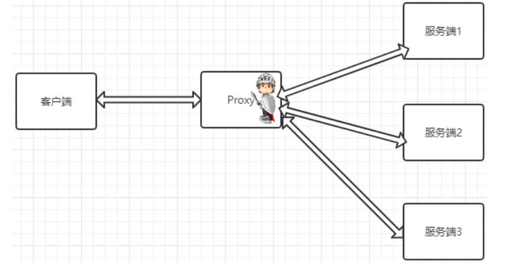

<h1 style="color:skyblue;text-align:center">Nginx学习笔记</h1>

# 概述

Nginx（“engine x”）一个具有高性能的**HTTP**和**反向代理**的**WEB服务器**，同时也是一个**POP3/SMTP/IMAP代理服务器**，是由伊戈尔·赛索耶夫(俄罗斯人)使用C语言编写的，Nginx的第一个版本是2004年10月4号发布的0.1.0版本。另外值得一提的是伊戈尔·赛索耶夫将Nginx的源码进行了开源，这也为Nginx的发展提供了良好的保障。

## 名词解释

### POP3

POP3(Post Offic Protocol 3)邮局协议的第三个版本

### SMTP

SMTP(Simple Mail Transfer Protocol)简单邮件传输协议

### IMAP

IMAP(Internet Mail Access Protocol)交互式邮件存取协议

### 正向代理

正向代理是一个位于客户端和原始服务器(origin server)之间的服务器，为了从原始服务器取得内容，客户端向代理发送一个请求并指定目标(原始服务器)，然后代理向原始服务器转交请求并将获得的内容返回给客户端。客户端才能使用正向代理

### 反向代理

反向代理服务器位于用户与目标服务器之间，但是对于用户而言，反向代理服务器就相当于目标服务器，即用户直接访问反向代理服务器就可以获得目标服务器的资源。同时，用户不需要知道目标服务器的地址，也无须在用户端作任何设定。反向代理服务器通常可用来作为Web加速，即使用反向代理作为Web服务器的前置机来降低网络和服务器的负载，提高访问效率

## Nginx的优点

### 速度更快、并发更高

单次请求或者高并发请求的环境下，Nginx都会比其他Web服务器响应的速度更快。一方面在正常情况下，**单次请求会得到更快的响应**，另一方面，**在高峰期(如有数以万计的并发请求)，Nginx比其他Web服务器更快的响应请求**。Nginx之所以有这么高的并发处理能力和这么好的性能原因在于**Nginx采用了多进程和I/O多路复用(epoll)的底层实现**

### 配置简单，扩展性强

Nginx的设计**极具扩展性**，它本身就是由很多模块组成，这些模块的使用可以通过配置文件的配置来添加。这些模块有官方提供的也有第三方提供的模块，如果需要完全可以开发服务自己业务特性的定制模块

### 高可靠性

Nginx采用的是**多进程模式运行**，其中有**一个master主进程和N多个worker进程**，worker进程的数量我们可以手动设置，每个worker进程之间都是相互独立提供服务，并且master主进程可以在某一个worker进程出错时，快速去"拉起"新的worker进程提供服务

### 热部署

现在互联网项目都要求以7*24小时进行服务的提供，针对于这一要求，Nginx也提供了热部署功能，即**可以在Nginx不停止的情况下，对Nginx进行文件升级、更新配置和更换日志文件**等功能

### 成本低、BSD许可证

BSD是一个开源的许可证

Nginx本身是开源的，我们不仅可以**免费的将Nginx应用在商业领域**，而且**还可以在项目中直接修改Nginx的源码来定制自己的特殊要求**

## Nginx常用功能

### 基本HTTP服务

Nginx可以提供基本HTTP服务，可以作为HTTP代理服务器和反向代理服务器，支持通过缓存加速访问，可以完成简单的负载均衡和容错，支持包过滤功能，支持SSL等。

- 处理静态文件、处理索引文件以及支持自动索引；
- 提供反向代理服务器，并可以使用缓存加上反向代理，同时完成负载均衡和容错；
- 提供对FastCGI、memcached等服务的缓存机制，，同时完成负载均衡和容错；
- 使用Nginx的模块化特性提供过滤器功能。Nginx基本过滤器包括gzip压缩、ranges支持、chunked响应、XSLT、SSI以及图像缩放等。其中针对包含多个SSI的页面，经由FastCGI或反向代理，SSI过滤器可以并行处理。
- 支持HTTP下的安全套接层安全协议SSL.
- 支持基于加权和依赖的优先权的HTTP/2

### 高级HTTP服务

- 支持基于名字和IP的虚拟主机设置
- 支持HTTP/1.0中的KEEP-Alive模式和管线(PipeLined)模型连接
- 自定义访问日志格式、带缓存的日志写操作以及快速日志轮转。
- 提供3xx~5xx错误代码重定向功能
- 支持重写（Rewrite)模块扩展
- 支持重新加载配置以及在线升级时无需中断正在处理的请求
- 支持网络监控
- 支持FLV和MP4流媒体传输

### 邮件服务

Nginx提供邮件代理服务也是其基本开发需求之一，主要包含以下特性：

- 支持IMPA/POP3代理服务功能
- 支持内部SMTP代理服务功能

# 常见服务器

## IIS

全称(**Internet Information Services**)即互联网信息服务，是由微软公司提供的基于windows系统的互联网基本服务。windows作为服务器在稳定性与其他一些性能上都不如类UNIX操作系统，因此在需要高性能Web服务器的场合下，IIS可能就会被"冷落"

## Tomcat

Tomcat是一个运行Servlet和JSP的Web应用软件，Tomcat技术先进、性能稳定而且开放源代码，因此深受Java爱好者的喜爱并得到了部分软件开发商的认可，成为目前比较流行的Web应用服务器。但是Tomcat天生是一个**重量级**的Web服务器，**对静态文件和高并发的处理比较弱**

## Apache

Apache的发展时期很长，同时也有过一段辉煌的业绩。在2014年以前都是市场份额第一的服务器。Apache有很多优点，如**稳定、开源、跨平台**等。但是它出现的时间太久了，在它兴起的年代，互联网的产业规模远远不如今天，所以它被设计成一个**重量级的、不支持高并发**的Web服务器。在Apache服务器上，**如果有数以万计的并发HTTP请求同时访问，就会导致服务器上消耗大量能存，操作系统内核对成百上千的Apache进程做进程间切换也会消耗大量的CUP资源，并导致HTTP请求的平均响应速度降低**，这些都决定了Apache不可能成为高性能的Web服务器。这也促使了Lighttpd和Nginx的出现

## Lighttpd

Lighttpd是德国的一个开源的Web服务器软件，它和Nginx一样，都是**轻量级、高性能**的Web服务器，欧美的业界开发者比较钟爱Lighttpd，而国内的公司更多的青睐Nginx，同时**网上Nginx的资源要更丰富些**

## 其他的服务器

Google Servers，Weblogic, Webshpere(IBM)...

